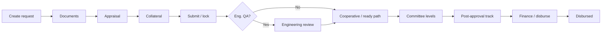

# DECSI Loan Hub

A Django-based **loan origination and credit operations platform** for microfinance institutions. It digitizes the MSME (and corporate) loan lifecycle—from branch intake and document verification, through cashflow-based appraisal and GPS-backed collateral valuation, multi-level credit committee approval, post-approval conditions, and CBS-linked disbursement.

Built around **DECSI** (Dedebit Credit and Savings Institution) practices: branch → district → head-office workflows, construction-based building valuation catalogs, Excel-aligned appraisal sheets, and integrations with core banking and Ethiopia-local maps.

---

## Table of contents

- [Overview](#overview)
- [Key features](#key-features)
- [Technology stack](#technology-stack)
- [Architecture](#architecture)
- [User roles](#user-roles)
- [Loan lifecycle](#loan-lifecycle)
- [Agentic Assist](#agentic-assist)
- [Credit Intelligence](#credit-intelligence)
- [Collateral valuation](#collateral-valuation)
- [Loan appraisal](#loan-appraisal)
- [Document authentication](#document-authentication)
- [Credit committee workflow](#credit-committee-workflow)
- [Post-approval & disbursement](#post-approval--disbursement)
- [Core banking & maps](#core-banking--maps)
- [Project structure](#project-structure)
- [Getting started](#getting-started)
- [Environment variables](#environment-variables)
- [Management commands](#management-commands)
- [Running tests](#running-tests)
- [CI/CD](#cicd)
- [Related documentation](#related-documentation)

---

## Overview

DECSI Loan Hub replaces manual queuing, incomplete document submissions, and sequential paper approvals with a single staff web app. Branch, district, and head-office users work from **role-scoped** dashboards.

Officers complete a **seven-step appraisal** (MSME cashflow or corporate mode), capture **field evidence** for buildings/land/other collateral, and pass files through **configurable committees**. After approval, a **post-approval track** handles conditions, repayment schedules, readiness, and optional **CBS booking** on disbursement.

Optional AI layers assist staff without replacing policy gates:

- **Agentic Assist** — conversational loan draft + guarded tools (create request / list docs / read appraisal); **cannot** approve, value collateral, or disburse
- **Credit Intelligence** — portfolio KPIs, officer/manager workspaces, collateral risk views, decision support
- **Analysis assist** — in-appraisal scorecard insights and policy gate warnings

---

## Key features

| Area | Capabilities |
|------|-------------|
| **Loan intake** | Create requests (branch or HO Credit), assign loan officers, customer number / party API lookup |
| **Documents** | Configurable types, upload/review, OCR (English + Amharic), content validation, reference-sample matching, identity field checks |
| **Appraisal** | MSME cashflow or corporate mode; sheets 1–7; scorecard & analysis gates; Excel/PDF appraisal packs |
| **Collateral** | DECSI construction catalog, land & other items, GPS photos, Gebeta/OSM maps, coverage rules, evidence pack |
| **Governance** | Lock after submit, audit trail, unlock workflow, engineering QA queue |
| **Approvals** | Branch Cooperative intake queue, multi-level committees (amount routing, tie-breakers), return-to-officer |
| **Post-approval** | Conditions checklist, schedule confirm, mark ready, Finance gate, mark disbursed (CBS optional) |
| **Agentic Assist** | Floating chat + `/agent/`; draft **story**; branch manager bootstrap; document checklist; appraisal read-only; full run audit |
| **Credit Intelligence** | Overview KPIs, officer/manager workspaces, portfolio & collateral analytics, CI assistant APIs |
| **Administration** | Geography, departments, branches, committees UI, document types, bulk Excel imports |
| **Reporting** | Scoped reports, branch dashboard, exports |

---

## Technology stack

| Layer | Technology |
|-------|------------|
| Backend | Python 3.9, Django 3.2 |
| Database | PostgreSQL 16 |
| Frontend | Django templates, jQuery, Leaflet/MapLibre (Gebeta tiles), agent chat widget CSS/JS |
| Documents | Tesseract OCR (`eng` + `amh`), Pillow, pypdf, pdf2image |
| PDF/Excel packs | openpyxl, reportlab, WeasyPrint (HTML→PDF appraisal) |
| Data import | pandas, django-import-export |
| AI (optional) | OpenAI-compatible tool calling (or stub without key); Azure OpenAI supported |
| API | DRF / SimpleJWT / drf-yasg (present); CI + agent JSON endpoints |
| Deployment | Docker, Docker Compose, optional nginx HTTPS overlay for field tablets |

---

## Architecture

```
┌──────────────────────────────────────────────────────────────────┐
│  Staff browser · floating Agentic Assist · tablet field HTTPS     │
└───────────────────────────────┬──────────────────────────────────┘
                                │
┌───────────────────────────────▼──────────────────────────────────┐
│  Django (decsi_loan)                                              │
│  ┌────────────────────────────┐  ┌────────────────────────────┐  │
│  │ loans                      │  │ collateral                   │  │
│  │ • Intake & documents       │  │ • Catalog & unit prices      │  │
│  │ • Appraisal / scorecard    │  │ • Buildings / land / other   │  │
│  │ • Committees & post-approve│  │ • Field visit + GPS + maps   │  │
│  │ • Agent + Credit Intel.    │  │ • Policy, unlock, eng. QA    │  │
│  │ • Disbursement + ledger    │  │ • Evidence pack              │  │
│  └────────────────────────────┘  └────────────────────────────┘  │
└───────────────────────────────┬──────────────────────────────────┘
                                │
         ┌──────────────────────┼──────────────────────┐
         ▼                      ▼                      ▼
   PostgreSQL              Media files           External
   (loan data)             (docs / photos)       DECSI party/CBS,
                                                 Gebeta Maps, LLM
```

- **`loans`** — users, origination, appraisal, AI assist, committees, notifications, reporting, disbursement
- **`collateral`** — physical estimation, field capture, governance  
(`partners` holds early PLSA-related scaffolding; not wired into `INSTALLED_APPS` for the loan hub runtime)

---

## User roles

| Role | Typical responsibilities |
|------|------------------------|
| `superadmin` / `admin` | System config, users, policies |
| `branch_manager` | Create loans (incl. via agent), assign officers, engineering handoff, committee submit |
| `loan_officer` | Docs, appraisal, collateral (when mode allows); agent document/appraisal tools |
| `credit_loan_officer` | Head-office Credit loans and appraisal |
| `credit_head` | HO credit oversight, committee configuration |
| `cooperative_manager` | Branch Cooperative **intake queue** (gate before LO work on branch loans) |
| `finance_manager` | Disbursement approval after committee readiness (not intake); HO committee |
| `accountant` | Committee vote + post-approval mark-ready (branch/district scoped) |
| `district_manager` | District oversight, district LO assignment, district committee |
| `engineering_head` / `engineer` | Valuation queue, unit prices, field visits, engineering QA |
| `ceo` / `vp` / `vp_operations` / `vp_it` / `vp_customer_service` / `board_member` | Management / board voting |
| `risk_compliance` / `auditor` | Review, reports (scope by branch/district when set) |

Legacy role values (`operation_manager`, `credit_committee`) remain for old rows only. HO users may link to a **Department** (Cooperative, Finance, Credit, Management, Board).

Roles live on `loans.CustomUser` and drive menus, reporting scope, agent capabilities, and committee membership.

---

## Loan lifecycle



1. **Intake** — Branch manager (or HO Credit) creates a `LoanRequest`; optional party lookup by customer number.
2. **Documents** — Type-driven uploads with automated auth pipeline.
3. **Appraisal** — Assigned LO completes MSME or corporate sheets; analysis assist flags gates (not auto-approve).
4. **Collateral** — Buildings/land/other + field GPS; optional engineering team mode.
5. **Submit & lock** — Estimation locked; unlock requests for corrections.
6. **Engineering QA** — When configured, pending → approved/returned.
7. **Cooperative queue** — Branch Cooperative for branch-originated flow (HO Credit can skip).
8. **Committee** — Amount-based levels; vote, decline, or return to officer; appraisal pack for members.
9. **Post-approval** — Conditions → schedule confirm → mark ready → Finance / officer mark disbursed (optional CBS book).

---

## Agentic Assist

In-app AI co-pilot for trusted staff (floating widget + `/agent/`).

### Access

| Capability | Roles (server-enforced) |
|------------|-------------------------|
| Open chat | Branch manager, LO, credit LO, admin, superadmin |
| **Create / bootstrap loan** | **Branch manager only** |
| Document checklist tools | BM, LO, credit LO, admin |
| Read appraisal coach | LO, credit LO, BM, admin |

### What it can do

- Hold an editable **story** (draft borrower/amount/purpose) before any DB loan exists  
- **commit_story** / **bootstrap_loan** — bare application; optional collateral **shells only**  
- **register_collateral** — placeholders (no quantities/prices)  
- **document_checklist**, **find_loans**, **pipeline_report**, **read_appraisal**, **lookup_workspace**

### What it must not do (blocked server-side)

Approve, committee submit, disburse, draft/seed full appraisal, attach fake docs as production path, or run valuation estimation tools.

### Implementation

| Module | Role |
|--------|------|
| `loans/agent_chat.py` | LLM tool-calling loop (OpenAI / Azure / stub) |
| `loans/agent_tools.py` | Tool specs + dispatch |
| `loans/agent.py` | Bootstrap policy & pipeline |
| `loans/agent_permissions.py` | Role gates |
| `loans/agent_story.py` | Conversation story |
| `AgentConversation` / `AgentRun` | Persist chat, story, audit steps |
| `static/js/agent_widget.js` + CSS | Floating UI |

Configure via `AGENT_LLM_PROVIDER`, `OPENAI_*` (see [Environment variables](#environment-variables)).

---

## Credit Intelligence

Role-scoped dashboard under `/credit-intelligence/`:

| Surface | Purpose |
|---------|---------|
| Overview | Pipeline KPIs, MoM deltas, risk band, watchlist, insights |
| Officer / Manager | Workspaces and alerts |
| Portfolio | Analytics over book amounts (committee → appraisal → requested) |
| Collateral | Collateral intelligence aggregates |
| Assistant | Guided Q&A over scoped data |

JSON APIs: `/api/credit-intelligence/overview/`, assistant, and per-application decision. Scope follows the same reporting rules as export reports. CBS outstanding/NPL may be stubbed when ledger is mock.

---

## Collateral valuation

### Asset classes

- **Buildings** — `MainWork` → `SubWork` → `SubSubWork`; woreda unit prices; photos with GPS  
- **Land** — area × ETB/m² + field visit steps  
- **Other** — movable items with estimate and field capture  

### Policy & governance

`CollateralPolicyConfig`: min photos, GPS weak threshold, photo-to-site distance, coverage ratio, address mismatch rules.

After submit: **immutable** (unless unlock approved), `CollateralFieldAuditLog`, evidence pack for committees, optional **engineering QA** in engineering-team mode.

Maps: **Gebeta** (when API key set) or Leaflet/OSM fallback.

Tablet field capture: use [HTTPS overlay](#https-for-tablets-gps--camera-on-lan) for secure-context GPS/camera on LAN devices.

---

## Loan appraisal

Aligned with `presentation/LOAN_APPRAISAL_EXCEL_STRUCTURE.md`.

| Mode | When |
|------|------|
| **MSME / cashflow** | Default; full cashflow sheets |
| **Corporate** | Category or appraisal `appraisal_mode=corporate` (qualitative + corporate gates) |

| Step | Content |
|------|---------|
| 1 | Basic info / business / loan request (+ banking intake fields) |
| 2 | Credit history + qualitative factors (~75% pass gate) |
| 3 | Cashflow, ratios, DSCR, capacity |
| 4 | E&S checklist and eligibility |
| 5 | Collateral worksheet |
| 6 | Summary, scorecard pillars, recommendation |
| 7 | Repayment schedule / amortization |

Extras: completeness policy, analysis assist panel, feature JSON for UI, **Excel + PDF pack** export for committee.

---

## Document authentication

Per `LoanApplicationDocumentType`:

- Extension / size limits (global defaults on policy model)  
- OCR (`DOCUMENT_OCR_LANG`, default `eng+amh`)  
- Phrase and **reference-sample** similarity  
- Identity fields (name, phone, TIN, business)  
- Extraction mappings into appraisal  
- Optional external party ID check  

Statuses: `pending` → `auto_passed` / `needs_review` → `verified` / `rejected`.

---

## Credit committee workflow

Configurable (admin + in-app manage screens):

- **`ApprovalCommitteeLevel`** — sequence, amount min/max, active flag, tie-breaker role  
- **`ApprovalCommitteeMemberRule`** — role or named user  
- **`BranchCommitteeOverride`** — branch-specific branch-level roster  
- **`LoanApprovalLevelProgress`** — per-loan level status  

`loans/committee.py` routes by recommended or requested amount. Outcomes: approve, decline, return to officer. Notifications in-app (email optional).

---

## Post-approval & disbursement

After `committee_status = approved`, `/post_approval/`:

1. Close/required **conditions**  
2. Generate / confirm **repayment schedule**  
3. Mark file **ready** for release  
4. **Mark disbursed** — may call CBS book endpoint when `DECSI_CBS_BOOK_ON_DISBURSE` is on  

See `loans/disbursement.py` and `loans/portfolio_ledger.py` (adapter: auto/CBS/stub/mock).

---

## Core banking & maps

| Integration | Purpose |
|-------------|---------|
| DECSI party API | Customer details / transactions for intake (mock fallback available) |
| CBS ledger adapter | Outstanding + disbursement booking |
| Gebeta Maps | Geocoding + Ethiopia styles; Nominatim/OSM fallback |

---

## Project structure

```
decsi_loan/
├── decsi_loan/                 # Settings, root URLs, WSGI
├── loans/
│   ├── models.py               # Users, loans, appraisal, agent, committees…
│   ├── views.py / views_agent.py / views_credit_intelligence.py
│   ├── agent*.py               # Agentic Assist
│   ├── credit_intelligence.py / ci_*.py
│   ├── committee.py / disbursement.py / portfolio_ledger.py
│   ├── appraisal_*.py / analysis_assist.py / cashflow_utils.py
│   ├── reporting.py
│   ├── services/               # Document auth, notifications, customer
│   └── tests/                  # Unit/integration suites
├── collateral/                 # Valuation, field, policy, eng. QA
├── templates/ / static/        # UI, agent widget, maps JS
├── deploy/https/               # nginx + cert config for field HTTPS
├── scripts/gen_field_https_certs.sh
├── presentation/               # Excel/appraisal reference docs
├── docs/                       # PLSA and other product specs (related)
├── docker-compose.yml
├── docker-compose.https.yml
├── Dockerfile
├── requirements.txt
└── manage.py
```

---

## Getting started

> **DECSI / Dedebit IT (on-prem):** one-command install from GitHub — see [`INSTALL_DECSI.md`](INSTALL_DECSI.md)  
> (`./scripts/install_decsi.sh`). Full guide: [`docs/deployment/DEDEBIT_ON_PREM_INSTALLATION.md`](docs/deployment/DEDEBIT_ON_PREM_INSTALLATION.md).  
> Also: [`docs/user_manual/06_installation_it.md`](docs/user_manual/06_installation_it.md) (Hub → **Help**).

### Prerequisites

- Docker Compose, **or** Python 3.9+, PostgreSQL 16
- Host OCR + PDF stack if not using Docker: Tesseract (eng/amh), poppler, WeasyPrint libs (Pango/Cairo)

### Docker Compose — DECSI simple install (recommended)

```bash
git clone https://github.com/habenkiros/decsi_loan.git
cd decsi_loan
./scripts/install_decsi.sh
```

App: **http://\<server-ip\>:8000** · Staff: **/hub/login/** · License: **/license/**

### Docker Compose — manual

```bash
cd decsi_loan
cp .env.example .env   # set SECRET_KEY, LICENSE_KEY, DB_PASSWORD, ALLOWED_HOSTS
docker compose up --build -d
docker compose exec web python manage.py migrate
docker compose exec web python manage.py createsuperuser
```

#### HTTPS for tablets (GPS / camera on LAN)

```bash
./scripts/gen_field_https_certs.sh
docker compose -f docker-compose.yml -f docker-compose.https.yml up --build
```

Open **https://\<any-server-lan-ip\>:8443** (install the field CA on phones). The cert covers current LAN addresses and each private /24, so DHCP does not require a baked IP. Local laptop can stay on **http://localhost:8000**.

Default DB (compose):

| Variable | Default |
|----------|---------|
| `POSTGRES_DB` | `decsiloandb` |
| `POSTGRES_USER` | `decsiloandbuser` |
| `POSTGRES_PASSWORD` | `decsiloandbpassword` |

### Local without Docker

```bash
python -m venv .venv && source .venv/bin/activate
pip install -r requirements.txt
# Point DATABASES host to localhost (settings default is `db` for Compose)
python manage.py migrate
python manage.py createsuperuser
python manage.py runserver
```

### Initial configuration

Imports:

```bash
python manage.py generate_migration_templates   # writes docs/migration_templates/
python manage.py import_migration_pack docs/migration_templates/DECSI_Migration_Pack.xlsx --default-password 'ChangeMeNow!'
# or one entity at a time:
python manage.py import_regions <file>
python manage.py import_zones <file>            # geographic zones (region + name)
python manage.py import_cities <file>
python manage.py import_districts <file>        # operational districts
python manage.py import_branches <file>
python manage.py import_loan_categories <file>
python manage.py import_collateral_types <file>
python manage.py import_document_types <file>
python manage.py import_users <file> --default-password 'ChangeMeNow!'
python manage.py import_loan_requests <file>
```

In admin / superadmin UI, set:

- Collateral estimation mode (LO / engineering / both)  
- Collateral field policy  
- Document authentication defaults and document types  
- Approval committee levels and members  

---

## Environment variables

Create `.env` in the project root (and `deploy/https/.env.https` for field HTTPS).

### Core

| Variable | Description | Default |
|----------|-------------|---------|
| `SECRET_KEY` | Django secret | `default_secret_key` |
| `DEBUG` | Debug flag (see settings) | `False` |
| `DB_NAME` / `DB_USER` / `DB_PASSWORD` | PostgreSQL | `decsiloandb*` defaults |
| `SITE_URL` | Absolute base URL (notifications, CSRF helpers) | `http://localhost:8000` |
| `DOCUMENT_OCR_LANG` | Tesseract packs | `eng+amh` |

### Email

| Variable | Description |
|----------|-------------|
| `DEFAULT_FROM_EMAIL`, `EMAIL_BACKEND`, `EMAIL_HOST`, `EMAIL_PORT`, `EMAIL_HOST_USER`, `EMAIL_HOST_PASSWORD`, `EMAIL_USE_TLS` | Optional SMTP |

### DECSI party & CBS

| Variable | Description | Default |
|----------|-------------|---------|
| `DECSI_BASE_URL` | Core banking base URL | empty |
| `DECSI_CUSTOMER_TIMEOUT` | Party API timeout | `8` |
| `DECSI_CUSTOMER_FORCE_MOCK` / `DECSI_CUSTOMER_FALLBACK_MOCK` | Mock party when offline | fallback on |
| `DECSI_LEDGER_ADAPTER` | `auto` \| `cbs` \| `stub` | `auto` |
| `DECSI_CBS_ENABLED` | Enable CBS path | `True` |
| `DECSI_CBS_USE_MOCK_LEDGER` | Offline outstanding/booking | `True` |
| `DECSI_CBS_BOOK_ON_DISBURSE` | Require CBS success on mark disbursed | `True` |
| `DECSI_CBS_API_KEY` | Optional API key | — |
| `DECSI_OUTSTANDING_PATH` / `DECSI_DISBURSE_PATH` | Path templates | set in settings |

### Maps

| Variable | Description |
|----------|-------------|
| `GEBETA_MAPS_API_KEY` | Gebeta API key |
| `GEBETA_MAPS_GEOCODE_PROVIDER` | `auto` \| `gebeta` \| `nominatim` |
| `GEBETA_MAPS_TILES_PROVIDER` | `auto` \| `gebeta` \| `leaflet_osm` |
| `GEBETA_MAPS_*_STYLE_*` | Style JSON URLs |

### HTTPS field proxy

| Variable | Description |
|----------|-------------|
| `USE_HTTPS_PROXY` | Set `1` behind nginx TLS |
| `HTTPS_ALLOW_ANY_HOST` | `1` (default): accept any server IP / Host on the overlay |
| `CSRF_TRUSTED_ORIGINS` | Optional extra origins; do **not** pin a DHCP LAN IP |
| `HTTPS_SECURE_COOKIES` | `1` only with trusted public cert |

### Agentic Assist LLM

| Variable | Description | Default |
|----------|-------------|---------|
| `AGENT_LLM_PROVIDER` | `auto` \| `openai` \| `stub` | `auto` |
| `OPENAI_API_KEY` | Required for live LLM | empty (stub) |
| `OPENAI_BASE_URL` | OpenAI or Azure resource URL | `https://api.openai.com/v1` |
| `OPENAI_MODEL` | Model / deployment name | `gpt-4o-mini` |
| `OPENAI_API_VERSION` | Azure API version | empty |
| `AGENT_LLM_TIMEOUT` | Seconds | `60` |

Compose uses DB host **`db`**. Local runs need host `localhost` (edit settings or image env).

---

## Management commands

| Command | Purpose |
|---------|---------|
| `generate_migration_templates` | Write fillable Excel templates to `docs/migration_templates/` |
| `import_migration_pack` | All sheets from `DECSI_Migration_Pack.xlsx` |
| `import_regions` | Geographic regions |
| `import_zones` | Geographic zones (`region` + `name`) |
| `import_cities` | Cities / woredas (unit-price locations) |
| `import_districts` | Operational districts (legacy name-only “zones” files) |
| `import_branches` | Branches (`district` + `name`) |
| `import_departments` | HO departments |
| `import_loan_categories` | Products (`name`, `appraisal_mode`) |
| `import_collateral_types` | Collateral types (`name`, `kind`) |
| `import_document_types` | Application document catalog |
| `import_category_documents` | Per-loan-type document packs |
| `import_users` | Staff users and roles |
| `import_committee_levels` / `import_committee_members` | Approval chain |
| `import_construction_catalog` | BOQ catalog and woreda unit prices |
| `import_loan_requests` | Historical / new loan files |

---

## Running tests

```bash
python manage.py test

# Collateral
python manage.py test collateral.tests

# Loans (examples)
python manage.py test loans.tests.test_agent_assist
python manage.py test loans.tests.test_credit_intelligence
python manage.py test loans.tests.test_credit_intelligence_phases
python manage.py test loans.tests.test_disbursement_track
python manage.py test loans.tests.test_cbs_ledger
python manage.py test loans.tests.test_org_roles_restructure
python manage.py test loans.tests.test_committee_tiebreaker
python manage.py test loans.tests.test_analysis_assist_and_gates
python manage.py test loans.tests.test_banking_intake
python manage.py test loans.tests.test_corporate_appraisal_mode
```

Docker:

```bash
docker compose exec web python manage.py test
```

---

## CI/CD

`.github/workflows/docker-image.yml` builds the Docker image on pushes and PRs to `main`.

---

## Related documentation

| Path | Description |
|------|-------------|
| `docs/migration_templates/` | Fillable Excel pack for DECSI master data and loan migration |
| `docs/user_manual/README.md` | User manuals index (admin, staff, customers, market) |
| `docs/user_manual/01_admin.md` | Admin guide |
| `docs/user_manual/02_staff.md` | Staff hub guide |
| `docs/user_manual/03_customers.md` | Digital Apply customer guide |
| `docs/user_manual/04_market_partners.md` | Seqela Market guide |
| `docs/user_manual/05_screenshots.md` | How to refresh PNG captures (figures live in each chapter) |
| `docs/user_manual/06_installation_it.md` | IT installation & minimum requirements |
| `docs/user_manual/DECSI_Loan_Hub_User_Manuals.html` | Printable combined manuals (HTML) |
| `docs/user_manual/DECSI_Loan_Hub_User_Manuals.pdf` | Combined manuals (PDF) |
| `presentation/LOAN_APPRAISAL_EXCEL_STRUCTURE.md` | Excel sheets ↔ appraisal feature map |
| `presentation/LOAN_APPRAISAL_EXCEL_DATA.md` | Field-level Excel reference |
| `presentation/SHEET2_DROPDOWNS_AND_SHEET3_ANALYSIS_PLAN.md` | Qualitative + cashflow plan |
| `presentation/loan_application_proposal.html` | Loan hub case study / proposal deck |
| `docs/DECSI_PLSA_Technical_Specification.md` | PLSA engagement product (separate from loan hub; shared vendor/DECSI context) |
| `docs/PLSA Project Marketing Plan & Strategy (3).pdf` | PLSA marketing source |

---

## License

Proprietary — DECSI / internal use. Contact project maintainers for licensing.
