# DBE Credit Intelligence

**Development Bank of Ethiopia (DBE)** staff hub and Digital Apply portal for the full DFI credit book: origination, KYC, product-specific appraisal, GPS collateral, committees, contracting, equity / loan release, implementation monitoring, collections, and rehab.

The same Credit Intelligence factory is **live at DECSI** — 53,901 files, ETB 17.03B approved, ETB 13B+ disbursed. This repository is the **DBE** instance.

Brand defaults: `INSTITUTION_NAME=Development Bank of Ethiopia`, `INSTITUTION_SHORT=DBE`, `PRODUCT_NAME=Credit Intelligence`.

---

## Table of contents

- [What the system is](#what-the-system-is)
- [Who uses it](#who-uses-it)
- [How a file moves](#how-a-file-moves)
- [Entry points and URLs](#entry-points-and-urls)
- [Product families](#product-families)
- [Directorates and desks](#credit-spine-and-desks)
- [Digital Apply](#digital-apply)
- [Documents and KYC](#documents-and-kyc)
- [Appraisal](#appraisal)
- [Collateral](#collateral)
- [Committees](#committees)
- [Contracting, release, and CBS](#post-approval-rehab-and-disbursement)
- [Book operations](#book-operations)
- [Credit Intelligence](#credit-intelligence)
- [Agentic Assist](#agentic-assist)
- [Seqela Market](#seqela-market)
- [Administration and master data](#administration-and-master-data)
- [Security, MFA, and license](#security-licensing-and-mfa)
- [Integrations](#integrations)
- [Technology and architecture](#architecture)
- [Getting started](#getting-started)
- [Environment variables](#environment-variables)
- [Management commands](#management-commands)
- [Running tests](#running-tests)
- [CI/CD](#cicd)
- [Related documentation](#related-documentation)

---

## What the system is

DBE Credit Intelligence is one platform with four surfaces:

| Surface | Who | URL |
|---------|------|-----|
| **Staff hub** | Branch, district, and head-office staff | `/hub/` |
| **Digital Apply** | Persons, PFIs, and project promoters | `/` and `/apply/…` |
| **Collateral / field** | Engineers and officers on tablet or laptop | `/collateral/` |
| **Seqela Market** | External price reporters (public) | `/market-portal/` |

It is **not** a core banking system. Cash still posts in CBS. The hub owns the credit file: documents, appraisal, security, committee evidence, conditions, and the case file after disbursement.

AI assists officers. It does **not** approve, value collateral, or disburse.

---

## Who uses it

| Role | Typical work on the hub |
|------|-------------------------|
| `superadmin` / `admin` | Users, policies, committees, license, security audit |
| `branch_manager` | Create files (including via Agentic Assist), assign officers, committee submit |
| `loan_officer` / `credit_loan_officer` | Documents, appraisal or product desk, collateral (when mode allows) |
| `credit_head` | Credit oversight, CRM / Appraisal queues, committee configuration |
| `finance_manager` | Disbursement after committee readiness |
| `accountant` | Committee vote and mark-ready |
| `district_manager` | District oversight and committee |
| `engineering_head` / `engineer` | BOQ catalog, unit prices, field GPS, technical KYC, engineering QA |
| `legal_officer` | Legal pack, title, contracting, agreements |
| `ceo` / `vp` / `vp_operations` / `vp_it` / `vp_customer_service` / `board_member` | Management / board voting |
| `risk_compliance` | Risk desk review (not a committee vote by default) |
| `auditor` | Reports and audit packs (read-oriented) |
| `cooperative_manager` | Branch intake queue when that gate is on |

Head-office users also have a **Department** (`Department.key`) that is the **desk**: CRM, Appraisal, Engineering, Legal, Finance, HRM, External Fund, Ongoing Concern, Scan/Admin, ITS, MIS.

Menus are role-scoped (`loans/nav.py`). Risk, engineering, and auditor roles do not see committee vote queues even if a committee rule names them.

---

## How a file moves

Every product follows the same spine. Appraisal *content* changes by family.

```mermaid
flowchart LR
    A[Create or Digital Apply] --> B[Scan / documents]
    B --> C[KYC desks]
    C --> D[Appraisal / product desk]
    D --> E[CRM comment round]
    E --> F[Collateral if required]
    F --> G[Submit and lock]
    G --> H[Committee]
    H --> I[Contract / legal]
    I --> J[Finance / equity release]
    J --> K[Monitoring]
    K --> L[Rehab / collections]
```



1. **Intake** — CRM, HRM, or External Fund creates a `LoanRequest`, or Digital Apply is queued through Scan / Admin.
2. **Documents** — Type-driven uploads, OCR, quality scores, identity case, selfie.
3. **KYC** — Parallel CRM, Engineering, and Legal checklists. Entity files add directors / UBOs.
4. **Appraisal** — Seven sheets **or** the family product desk. Analysis assist flags gates; it does not auto-approve.
5. **CRM round** — Product files send the pack to CRM. Committee waits for a cleared round.
6. **Collateral** — Title, owner, GPS. Lease / plant use financed-asset photos.
7. **Lock** — Estimation locked. Unlock workflow. Optional engineering QA.
8. **Committee** — Amount-based levels. Fund and engine blockers can stop submit.
9. **Contract and release** — Conditions, schedule, Finance. Project draws may need an implementation visit.
10. **Monitoring / rehab** — Visits, covenants, watchlist, restructure, collections. Cash still posts in CBS.

Committee status on the file: not submitted → pending / pended → approved, declined, or returned to officer.

Disbursement track: awaiting conditions → schedule confirmed → ready → partial → disbursed.

---

## Entry points and URLs

| Page | Path |
|------|--------|
| Staff login | `/hub/login/` |
| Staff home | `/hub/` |
| Digital Apply landing | `/` |
| License | `/license/` |
| Django admin | `/admin/` |
| Remote agreement signing (OTP, no staff login) | `/sign/agreement/<token>/` |
| Field collateral | `/collateral/` |
| Seqela Market | `/market-portal/` |
| Help (staff) | `/hub/help/` |

Staff desks:

| Desk | Path |
|------|------|
| KYC | `/hub/kyc/` |
| Appraisal Directorate | `/hub/appraisal/` |
| ITS | `/hub/its/` |
| PM & MIS | `/hub/mis/` |
| Legal | `/hub/legal/` |
| Risk | `/hub/risk/` |
| Compliance / AML | `/hub/compliance/` |
| Monitoring | `/hub/monitoring/` |
| Collections | `/hub/collections/` |
| Rehab | `/hub/rehab/` |
| Credit Intelligence | `/hub/credit-intelligence/` |
| Agentic Assist | `/hub/agent/` |
| Post-approval queue | `/hub/post_approval/` |

Legacy `/staff/…` redirects to `/hub/…`. Public `/applicant-portal/` redirects to `/`.

---

## Product families

`LoanCategory.product_family` selects the engine (`loans.engines.get_engine`). Credit can change defaults in admin (`ProductFamilyPolicy`) without a code deploy: whether collateral is required, which kinds, and the suggested appraisal mode.

Seed DBE categories and sample donor windows (KfW, RUFIP III, SMEFP):

```bash
python manage.py seed_dbe_product_catalog
```

| Family | Intake desk | Appraisal | Typical party | Security |
|--------|-------------|-----------|---------------|----------|
| **Project financing** | CRM | Project desk: sources & uses, COMFAR-style cashflow (revenue, opex, capacity %), equity stages, implementation visits | Promoter | Site and/or plant financed |
| **Lease / Ijarah** | CRM | Asset file, rent lines, Sharia review (Ijarah) | Person | Financed asset (title with DBE) |
| **Wholesale / PFI** | External Fund | PFI facility lines and utilization | Bank / MFI | None (PFI on-lending) |
| **Consumer** | HRM | HRM scorecard | Person | House or financed vehicle |
| **Murabaha** | CRM | Cost-plus contract, Sharia review | Person | Financed or movable |
| **Idea / quasi-equity** | CRM | Cap table | Promoter | None |
| **External fund** | External Fund | Window covenants on any family; sheets until Credit gives the window its own pack | Person or tagged file | As the window requires |
| **MSME / corporate** | Credit | Seven-sheet wizard | Person (CBS customer number) | Building, land, movable, mixed |

Officer product files (same rows Digital Apply can pre-fill):

| Family | Hub path |
|--------|----------|
| Project | `/hub/loan_request/<id>/project/` |
| Wholesale / PFI | `/hub/loan_request/<id>/pfi/` |
| Lease / Ijarah | `/hub/loan_request/<id>/lease/` |
| Murabaha | `/hub/loan_request/<id>/murabaha/` |
| Idea | `/hub/loan_request/<id>/idea/` |
| Consumer | `/hub/loan_request/<id>/consumer/` |
| Fund tag | `/hub/loan_request/<id>/fund-tag/` |

Engines never own CBS. They expose `committee_blockers`, `disbursement_blockers`, `consume_draw`, and `file_summary`.

Financing funds (`FinancingFund`) carry envelope, DBE-to-PFI rate, max end-user rate, eligible regions, women / youth minima, PAR limits, and agreement reference. A file can be tagged to a window; committee and disbursement wait if covenants are broken.

---

## Credit spine and desks

Job is `CustomUser.role`. Desk is `Department.key` (`loans/dbe_desks.py`).

| Desk | Work |
|------|------|
| **Scan / Admin** | Online-apply pack quality before CRM sees the file |
| **CRM** | Origination, KYC, appraisal comment rounds, contracting, monitoring |
| **Appraisal Directorate** | Product-desk blockers, CRM rounds, committee-ready queue |
| **Engineering Directorate** | Technical KYC, site / plant, field GPS, BOQ |
| **Legal Affairs** | Legal pack, title, contracting |
| **Finance** | Disbursement and equity release |
| **HRM** | Consumer files |
| **External Fund & Wholesale** | PFI facilities and donor windows |
| **Ongoing Concern & Acquired Assets** | Rehab and foreclosure |
| **ITS** | Portal stuck, CBS booking failures |
| **PM & MIS** | Fund utilization, origination SLA |

Directorate inboxes (`/hub/appraisal/`, `/hub/its/`, `/hub/mis/`) are queues only — they do not create a second loan model.

---

## Digital Apply

Public portal for three actor kinds (`ApplicantAccount.actor_kind`):

| Actor | Register as | May apply for |
|-------|-------------|----------------|
| **Person** | MSME / retail customer | MSME / corporate, consumer, lease, Murabaha, Ijarah |
| **Institution** | Bank / MFI / PFI | Wholesale, external fund |
| **Promoter** | Project or idea promoter | Project, idea / quasi-equity |

### Applicant steps

1. Register and log in (`/register/`, `/login/`)
2. Start a file (`/apply/new/`) — product list is filtered by actor
3. Details (`/apply/<uuid>/details/`) — party and intake fields for that family
4. Product overlay (`/apply/<uuid>/product/`) — same project / lease / PFI / IFB / idea rows staff see
5. Documents (`/apply/<uuid>/documents/`) — required types, identity, selfie, related parties on entity files
6. Processing fee (`/apply/<uuid>/payment/`) — Chapa (or mock checkout if keys are empty)
7. Submit — mints a staff `LoanRequest` when payment is paid or waived

Staff screens: `/hub/manage_applicant_portal/` (fee, lockout, CBS-required registration) and `/hub/online_loan_intake/`.

Webhook: `/payments/chapa/webhook/`. Auto-queue after paid is `DECSI_AUTO_QUEUE_ON_PAID`.

Persons on MSME / corporate files can look up a CBS customer number (`/ajax/customer/`).

---

## Documents and KYC

### Document types

Each `LoanApplicationDocumentType` has allowed extensions, size, OCR, phrase / reference-sample matching, identity fields, and optional extraction into appraisal.

Statuses: `pending` → `auto_passed` / `needs_review` → `verified` / `rejected`.

OCR language: `DOCUMENT_OCR_LANG` (default `eng+amh`). Quality and near-duplicate scores are officer aids (`loans/services/document_forensics.py`), not a court authenticator.

Staff: `/hub/loan_request/<id>/documents/` plus authenticate / view / file routes. Officers can **request** a missing type from the applicant.

### Identity case

`KycIdentityCase` + `KycParty`:

- Applicant (and, on entity / corporate files: director, UBO, guarantor, spouse)
- ID kinds: Fayda FAN, national ID, kebele, passport, TIN, license
- Verify against Fayda / TIN (`IDENTITY_VERIFY_PROVIDER`)
- Selfie vs ID portrait (`BIOMETRIC_PROVIDER`, `BIOMETRIC_MATCH_MIN`)
- Band: clear / review / blocked

Sanctions / PEP screening includes related-party names (`/hub/compliance/`).

### Desk checklists

Product files run parallel packs (`loans/kyc_desk.py`) until Scan/Admin, CRM, Engineering, and Legal are complete. Family extras (for example plant note on project, ESMS on wholesale, cap table on idea) are added on top of the core list.

Hub: `/hub/kyc/` and `/hub/loan_request/<id>/crm-cycle/` (appraisal pack to CRM; committee waits for `cleared`).

---

## Appraisal

### MSME / corporate — seven sheets

Path: `/hub/loan_request/<id>/appraisal/step/<n>/`

| Step | Content |
|------|---------|
| 1 | Basic info, business, loan request, banking intake, CBS party |
| 2 | Credit history and qualitative factors (character / NBE-style factors) |
| 3 | Cashflow, ratios, DSCR, capacity |
| 4 | E&S checklist and eligibility |
| 5 | Collateral worksheet (plus BOQ status) |
| 6 | Scorecard pillars and recommendation |
| 7 | Repayment schedule / amortization |

Corporate mode (`appraisal_mode=corporate`) uses qualitative and corporate gates (including legal registration on sheet 1). Completeness policy and analysis assist (`analysis_assist.py`) warn; they do not auto-approve.

Excel / PDF pack for committee: `/hub/loan_request/<id>/appraisal_pack.xlsx` and `.pdf`. Field map: `presentation/LOAN_APPRAISAL_EXCEL_STRUCTURE.md`.

### Product desks (not the seven sheets)

| Family | What the officer fills |
|--------|------------------------|
| **Project** | Sources & uses lines, yearly cashflow (revenue, operating cost, capacity %), technical reviews, implementation visits that unlock draws, equity stages |
| **Wholesale / PFI** | PFI profile, facility, utilization (amount on-lent, repayment to DBE, sub-portfolio PAR) |
| **Lease / Ijarah** | Asset, rents, optional Sharia review |
| **Murabaha** | Cost-plus contract, Sharia review |
| **Idea** | Idea profile and cap table |
| **Consumer** | HRM consumer scorecard |
| **Fund** | Window tag and covenant remaining |

---

## Collateral

Module: `/collateral/` (staff login required by the views).

### Registration

Every building, land, movable, and financed item records (`collateral/registration.py`):

- Owner kind: borrower, DBE, or third party
- Owner name (defaults to the applicant when owner is the borrower)
- Title reference and issuing office
- Financed vs already owned (lease / Ijarah / project plant)

Engineering QA and field screens show ownership checks.

### Asset classes

- **Buildings** — BOQ catalog `MainWork` → `SubWork` → `SubSubWork`, woreda unit prices, GPS photos
- **Land** — area × ETB/m² plus field steps
- **Movable** — estimate and field capture (plate / serial)
- **Financed asset** — the machine, vehicle, or plant this facility buys (supplier offer + asset photos)

Site GPS may come from the tablet **or** a supervisor-attested manual pin.

### Field and tablet

- Multi-step field visit per asset
- EXIF GPS on photos; weak-GPS attestation
- Offline PWA: `/collateral/offline/…`, service worker, sync
- HTTPS overlay for camera / GPS on LAN: `docker-compose.https.yml` (port 8443)

### Governance

`CollateralPolicyConfig` (`/collateral/settings/policy/`): minimum photos, GPS weak threshold, photo-to-site distance, coverage ratio, address mismatch.

After submit the estimation is **immutable** unless an unlock is approved (`CollateralUnlockRequest`, audit `CollateralFieldAuditLog`). Evidence pack for committees. Engineering QA queue: `/collateral/engineering-qa/`. Dossier JSON / ZIP for the file.

Estimation mode (officer, engineering team, or both): `/hub/collateral_estimation_config/`.

Maps: Gebeta when `GEBETA_MAPS_API_KEY` is set, otherwise Leaflet / OSM.

---

## Committees

Configurable in admin and `/hub/` manage screens:

- **`ApprovalCommitteeLevel`** — sequence, amount min/max, active flag, tie-breaker role
- **`ApprovalCommitteeMemberRule`** — role or named user
- **`BranchCommitteeOverride`** — branch-level roster
- **`LoanApprovalLevelProgress`** — per-file level status

Routing (`loans/committee.py`) uses recommended or requested amount. Members vote, decline, or return to officer. Notifications are in-app (email optional).

Submit is blocked until KYC, CRM round, fund covenants, and the product engine are clear.

---

## Post-approval, rehab, and disbursement

After `committee_status = approved`, `/hub/post_approval/` and `/hub/loan_request/<id>/post_approval/`:

1. Close required **conditions**
2. Generate / confirm **repayment schedule**
3. Mark **ready** for release
4. **Mark disbursed** — optional CBS book (`DECSI_CBS_BOOK_ON_DISBURSE`)
5. **Tranches** and **equity verify** on project files; implementation visit can unlock the next draw
6. **Collateral legal documents** and **loan agreements** (print + remote OTP sign at `/sign/agreement/<token>/`)

Finance approval is a separate gate from intake.

**Rehab** (`/hub/rehab/`): watchlist → restructure / TA → recover → foreclosure → closed. Insurance, revaluation diary, and appeals sit on the same case. Origination SLA (target 45 days) is informational — not a committee gate.

Cash still posts in CBS. The hub is the credit case file.

---

## Book operations

| Desk | Path | What staff do |
|------|------|----------------|
| **Monitoring** | `/hub/monitoring/` | Site visits, covenant ticks, watchlist |
| **Collections** | `/hub/collections/` | Actions, arrears, workout, write-off case file |
| **Legal** | `/hub/legal/` | Per-file legal actions and pack |
| **Risk** | `/hub/risk/` | File-level risk review (not a committee vote) |
| **Compliance** | `/hub/compliance/` | Sanctions / PEP cases, rescreen, case actions |
| **ITS** | `/hub/its/` | Scan pending, CBS booking failed, portal stuck |
| **MIS** | `/hub/mis/` | Tagged funds, wholesale utilization overdue, SLA |

Reports: `/hub/view_report/`, branch dashboard, Excel exports. Scope follows the user’s branch / district.

Audit pack ZIP per file: `/hub/loan_request/<id>/audit_pack.zip`.

Delegations (`/hub/delegations/`): committee vote, cooperative intake, appraisal, finance disbursement, assign officer — with approve / reject / revoke.

---

## Credit Intelligence

`/hub/credit-intelligence/` — role-scoped, same reporting scope as exports.

| Surface | Purpose |
|---------|---------|
| Overview | Pipeline KPIs, MoM, risk band, watchlist, insights |
| Insights | Operational alerts (aging appraisal, committee SLA) |
| Officer / Manager | Workspaces |
| Portfolio | Book amounts |
| Collateral | Collateral aggregates |
| Assistant | Guided Q&A on scoped data |

JSON: `/hub/api/credit-intelligence/overview/`, assistant, `/hub/api/credit-intelligence/applications/<id>/decision/`.

Aging / SLA thresholds: `CI_AGING_APPRAISAL_DAYS`, `CI_COMMITTEE_SLA_DAYS`.

---

## Agentic Assist

Floating widget and `/hub/agent/` for trusted staff. Conversations persist (`AgentConversation`, `AgentRun`).

| Capability | Who (server-enforced) |
|------------|------------------------|
| Open chat | Branch manager, LO, credit LO, admin, superadmin |
| **Create / bootstrap a file** | **Branch manager only** |
| Document checklist / find loans / pipeline | BM, LO, credit LO, admin |
| Read appraisal coach | LO, credit LO, BM, admin |

Allowed tools include story draft, `bootstrap_loan`, `register_collateral` (shells only), `document_checklist`, `file_blockers`, `read_appraisal`. Family engines can attach an `assist_brief` (blockers, fund remaining, project totals).

**Blocked:** committee submit or vote, disburse, run valuation, seed a full appraisal, attach fake production documents.

LLM: `AGENT_LLM_PROVIDER` (`auto` / `openai` / `stub`). Empty `OPENAI_API_KEY` → stub.

---

## Seqela Market

Public `/market-portal/`: guest or registered reporters submit area and product prices. Staff use bands in collateral intelligence. Recompute bands: `python manage.py recompute_market_bands`.

---

## Administration and master data

Under `/hub/` (and Django `/admin/`):

| Area | What to configure |
|------|-------------------|
| Users | Roles, branch, district, department (desk), MFA |
| Geography | Regions, zones, cities / woredas (unit-price locations), districts, branches |
| Departments | Desk keys listed above |
| Loan categories | Name, family, appraisal mode, document pack, collateral required |
| Financing funds | Own book and donor windows |
| Collateral types | Name and kind |
| Construction catalog | Main / sub / sub-sub work and woreda unit prices |
| Document types | Auth rules, reference samples, category packs |
| Committees | Levels, members, branch overrides |
| Process policy | Completeness and analysis gates |
| Applicant portal | Fee, lockout, CBS-required registration |
| Collateral estimation | Officer vs engineering team vs both |
| Field policy | Photo / GPS / coverage rules |

Excel import: `generate_migration_templates` and `import_migration_pack` (workbook still named `DECSI_Migration_Pack.xlsx` on disk).

---

## Security, licensing, and MFA

- On-prem **Ed25519 license** (`LICENSE_KEY` / `SEQLA1.…`). Status: `/license/`. Commands: `issue_license`, `check_license`. Grace: `LICENSE_GRACE_DAYS`.
- Staff login lockout: `LOGIN_MAX_FAILED_ATTEMPTS`, `LOGIN_LOCKOUT_MINUTES`; unlock at `/hub/security/users/<id>/unlock/`
- **MFA (TOTP)** after password; optional `MFA_REQUIRED`. Setup / disable under `/hub/mfa/`
- Session idle timeout and keepalive
- Security audit log and export: `/hub/security/audit/`
- Password reset and change under `/hub/password-*`
- Browser: nosniff, `X_FRAME_OPTIONS=DENY`, HttpOnly session cookie
- Middleware: license enforcement, hub legacy redirects, delegation principal lockout

---

## Integrations

| System | Purpose | Config |
|--------|---------|--------|
| **CBS / party** | Customer lookup (Sheet 1, Digital Apply) | `BANK_CBS_BASE_URL` (alias `DECSI_BASE_URL`); mock if empty |
| **CBS ledger** | Outstanding and disbursement booking | `DECSI_LEDGER_ADAPTER`, `DECSI_CBS_*` |
| **Gebeta Maps** | Geocode and Ethiopia tiles | `GEBETA_MAPS_*`; OSM / Nominatim fallback |
| **Fayda / TIN** | Identity verify | `IDENTITY_VERIFY_PROVIDER`, URLs |
| **Face / liveness** | Selfie vs ID | `BIOMETRIC_*` |
| **Chapa** | Digital Apply fee | `CHAPA_*`; mock if keys empty |
| **OpenAI / Azure** | Agentic Assist | `OPENAI_*`, `AGENT_LLM_PROVIDER` |
| **Sanctions / PEP** | Compliance desk | `SANCTIONS_*` (mock demo names if unset) |
| **Email / SMS** | Resets, committee, applicant OTP | Django email; `APPLICANT_SMS_*` |
| **Tesseract** | OCR English + Amharic | `DOCUMENT_OCR_LANG` |

---

## Architecture

```
┌──────────────────────────────────────────────────────────────────┐
│  Staff hub · Digital Apply · field tablets · Seqela Market       │
└───────────────────────────────┬──────────────────────────────────┘
                                │
┌───────────────────────────────▼──────────────────────────────────┐
│  Django (package folder: decsi_loan/; brand: DBE)                │
│  loans · collateral · applicant_portal · partners                 │
└───────────────────────────────┬──────────────────────────────────┘
                                │
         ┌──────────────────────┼──────────────────────┐
         ▼                      ▼                      ▼
   PostgreSQL 16           Media files           CBS, Gebeta,
   credit files            docs / GPS photos   Fayda, Chapa, LLM
```

| App | Responsibility |
|------|----------------|
| `loans` | Users, files, families, engines, KYC, committees, funds, rehab, CI, agent, license |
| `collateral` | Title, BOQ, GPS, field, unlock, engineering QA |
| `applicant_portal` | Digital Apply accounts and steps |
| `partners` | Seqela Market prices and bands |

The Django project package on disk is still `decsi_loan/` (settings, URLs, WSGI). Runtime branding is DBE. Compose DB names default to `decsiloandb*` — rename in `.env` for a DBE server.

---

## Project structure

```
dbe_loan/
├── decsi_loan/                 # Settings, root URLs, WSGI
├── loans/                    # Credit factory
│   ├── branding.py
│   ├── product_family.py / family_policy.py / dbe_desks.py
│   ├── engines/
│   ├── kyc_desk.py / kyc_identity.py / crm_cycle.py / rehab.py
│   ├── views.py / views_*.py
│   └── tests/
├── collateral/               # Title, GPS, BOQ, QA
├── applicant_portal/        # Digital Apply
├── partners/                 # Seqela Market
├── templates/ / static/
├── deploy/https/            # Field-tablet TLS
├── presentation/             # DBE decks
├── docs/                     # Manuals, migration, install
├── docker-compose.yml
├── Dockerfile
└── manage.py
```

---

## Getting started

On-prem: [`INSTALL_DECSI.md`](INSTALL_DECSI.md) (`./scripts/install_decsi.sh`) and [`docs/deployment/DEDEBIT_ON_PREM_INSTALLATION.md`](docs/deployment/DEDEBIT_ON_PREM_INSTALLATION.md). Hub **Help**: [`docs/user_manual/06_installation_it.md`](docs/user_manual/06_installation_it.md).

### Prerequisites

- Docker Compose, **or** Python 3.9+ and PostgreSQL 16
- Without Docker: Tesseract (`eng` + `amh`), poppler, WeasyPrint (Pango / Cairo)

### Docker Compose (recommended)

```bash
git clone https://github.com/habenkiros/dbe_loan.git
cd dbe_loan
./scripts/install_decsi.sh
```

Then:

```bash
docker compose exec web python manage.py seed_dbe_product_catalog
```

| Page | URL |
|------|--------|
| Staff | `http://<server-ip>:8000/hub/login/` |
| Digital Apply | `http://<server-ip>:8000/` |
| License | `http://<server-ip>:8000/license/` |

### Docker Compose — manual

```bash
cd dbe_loan
cp .env.example .env
# SECRET_KEY, LICENSE_KEY, DB_PASSWORD, ALLOWED_HOSTS
docker compose up --build -d
docker compose exec web python manage.py migrate
docker compose exec web python manage.py seed_dbe_product_catalog
docker compose exec web python manage.py createsuperuser
```

#### HTTPS for field tablets (GPS / camera)

```bash
./scripts/gen_field_https_certs.sh
docker compose -f docker-compose.yml -f docker-compose.https.yml up --build
```

Open `https://<lan-ip>:8443` and install the field CA on the phone.

### Local without Docker

```bash
python -m venv .venv && source .venv/bin/activate
pip install -r requirements.txt
# DATABASES host localhost (Compose default is `db`)
python manage.py migrate
python manage.py seed_dbe_product_catalog
python manage.py createsuperuser
python manage.py runserver
```

### Initial configuration

```bash
python manage.py generate_migration_templates
python manage.py import_migration_pack docs/migration_templates/DECSI_Migration_Pack.xlsx --default-password 'ChangeMeNow!'
python manage.py import_financing_funds docs/migration_templates/16_Funding_Windows.xlsx
python manage.py seed_dbe_product_catalog
```

Then set family policies, funds, collateral mode, document types, committees, and desk departments.

Demo files through committee, legal, disbursement, rehab, and Digital Apply:

```bash
python manage.py seed_sample_data
```

---

## Environment variables

Create `.env` in the project root (and `deploy/https/.env.https` for field HTTPS).

### Core

| Variable | Description | Default |
|----------|-------------|---------|
| `SECRET_KEY` | Django secret | `default_secret_key` |
| `DEBUG` | Debug flag | `False` |
| `DB_NAME` / `DB_USER` / `DB_PASSWORD` | PostgreSQL | Compose `decsiloandb*` |
| `SITE_URL` | Absolute base URL | `http://localhost:8000` |
| `DOCUMENT_OCR_LANG` | Tesseract packs | `eng+amh` |
| `INSTITUTION_NAME` | Hub / portal brand | `Development Bank of Ethiopia` |
| `INSTITUTION_SHORT` | Short brand | `DBE` |
| `PRODUCT_NAME` | Product label | `Credit Intelligence` |
| `LICENSE_KEY` | On-prem `SEQLA1.…` key | empty |

### Email

`DEFAULT_FROM_EMAIL`, `EMAIL_BACKEND`, `EMAIL_HOST`, `EMAIL_PORT`, `EMAIL_HOST_USER`, `EMAIL_HOST_PASSWORD`, `EMAIL_USE_TLS`

### Core banking

Prefer `BANK_CBS_*`. `DECSI_*` names still work as aliases.

| Variable | Description | Default |
|----------|-------------|---------|
| `BANK_CBS_BASE_URL` | CBS / party base URL | empty (mock) |
| `BANK_CBS_API_KEY` | Optional API key | — |
| `DECSI_CUSTOMER_TIMEOUT` | Party timeout (seconds) | `8` |
| `DECSI_LEDGER_ADAPTER` | `auto` \| `cbs` \| `stub` | `auto` |
| `DECSI_CBS_ENABLED` | Enable CBS path | `True` |
| `DECSI_CBS_USE_MOCK_LEDGER` | Offline outstanding / booking | `True` |
| `DECSI_CBS_BOOK_ON_DISBURSE` | Require CBS success on mark disbursed | `True` |

### Identity, biometrics, sanctions, payments

| Variable | Description | Default |
|----------|-------------|---------|
| `IDENTITY_VERIFY_PROVIDER` | `off` \| `mock` \| `http` | `mock` |
| `FAYDA_VERIFY_URL` / `TIN_VERIFY_URL` | HTTP endpoints | empty |
| `BIOMETRIC_PROVIDER` | `off` \| `mock` \| `http` | `mock` |
| `BIOMETRIC_MATCH_MIN` | Minimum match score | `70` |
| `SANCTIONS_PROVIDER` | `off` \| `mock` \| `http` | `mock` |
| `CHAPA_SECRET_KEY` | Digital Apply fee | empty (mock) |

### Maps and field HTTPS

`GEBETA_MAPS_API_KEY`, `GEBETA_MAPS_GEOCODE_PROVIDER`, `GEBETA_MAPS_TILES_PROVIDER`.  
`USE_HTTPS_PROXY=1`, `HTTPS_ALLOW_ANY_HOST=1`. Do not pin `SITE_URL` to a single DHCP LAN IP.

### Agentic Assist

| Variable | Default |
|----------|---------|
| `AGENT_LLM_PROVIDER` | `auto` |
| `OPENAI_API_KEY` | empty (stub) |
| `OPENAI_BASE_URL` | `https://api.openai.com/v1` |
| `OPENAI_MODEL` | `gpt-4o-mini` |
| `AGENT_LLM_TIMEOUT` | `60` |

Compose DB host is **`db`**. Local runs use `localhost`.

---

## Management commands

| Command | Purpose |
|---------|---------|
| `seed_dbe_product_catalog` | DBE families and sample funding windows |
| `seed_sample_data` | Demo users, files, and factory-tour desks |
| `generate_migration_templates` | Excel templates in `docs/migration_templates/` |
| `import_migration_pack` | Full workbook |
| `import_regions` / `import_zones` / `import_cities` | Geography |
| `import_districts` / `import_branches` | Operations |
| `import_departments` | Directorate / desk departments |
| `import_loan_categories` | Products |
| `import_financing_funds` | Donor / own-book windows |
| `import_collateral_types` | Collateral types |
| `import_document_types` / `import_category_documents` | Document catalog |
| `import_users` | Staff |
| `import_committee_levels` / `import_committee_members` | Approval chain |
| `import_construction_catalog` | BOQ and woreda prices |
| `import_loan_requests` / `import_collaterals` | Historical files |
| `issue_license` / `check_license` | On-prem license |
| `recompute_market_bands` | Seqela Market bands |

---

## Running tests

```bash
python manage.py test

python manage.py test loans.tests.test_product_family
python manage.py test loans.tests.test_dbe_desks
python manage.py test loans.tests.test_dbe_registration
python manage.py test loans.tests.test_kyc_desk
python manage.py test loans.tests.test_kyc_identity
python manage.py test loans.tests.test_project_engine
python manage.py test loans.tests.test_project_comfar
python manage.py test loans.tests.test_fund_wholesale
python manage.py test loans.tests.test_lease_ijarah
python manage.py test loans.tests.test_murabaha_idea
python manage.py test loans.tests.test_rehab_sla
python manage.py test collateral.tests.test_registration
python manage.py test applicant_portal.tests.test_dbe_access
```

Docker: `docker compose exec web python manage.py test`

---

## CI/CD

`.github/workflows/docker-image.yml` builds the Docker image on pushes and PRs to `main`.

---

## Related documentation

| Path | Description |
|------|-------------|
| `presentation/dbe_ceo_briefing.html` | CEO briefing |
| `presentation/dbe_loan_hub_proposal.html` | DBE proposal deck |
| `presentation/dbe_loan_hub_proposal_document.html` | Proposal document |
| `presentation/dbe_server_specification.html` | Server specification |
| `docs/user_manual/README.md` | User manuals (admin, staff, customers, market) |
| `docs/deployment/DEDEBIT_ON_PREM_INSTALLATION.md` | On-prem install |
| `docs/deployment/CBS_CUTOVER_CHECKLIST.md` | CBS cutover |
| `docs/migration_templates/` | Excel master-data pack |
| `presentation/LOAN_APPRAISAL_EXCEL_STRUCTURE.md` | Seven-sheet field map |

---

## License

Proprietary — Seqela for the Development Bank of Ethiopia. Contact project maintainers for licensing.
