# DBE Credit Intelligence

A Django-based **credit origination and book-operations platform** for the **Development Bank of Ethiopia (DBE)**. It is the same Credit Intelligence factory already live at **DECSI**, configured here for DBE’s product families: project finance, lease / Ijarah, wholesale / PFI, consumer, Murabaha, idea / quasi-equity, and donor-funded windows — plus the MSME / corporate 7-sheet path.

This copy brands as DBE (`INSTITUTION_NAME` / `INSTITUTION_SHORT`). DECSI production stays on its own deploy.

**Live at DECSI** (Tsige Bayray, Vice Chief of IT · +251 914 701 978): 53,901 applications · ETB 29.56B requested · ETB 17.03B approved · 25,397 customers approved · ETB 13B+ disbursed.

---

## Table of contents

- [Overview](#overview)
- [What is the same vs what is DBE](#what-is-the-same-vs-what-is-dbe)
- [Key features](#key-features)
- [Product families](#product-families)
- [Credit spine & desks](#credit-spine--desks)
- [Digital Apply](#digital-apply)
- [Technology stack](#technology-stack)
- [Architecture](#architecture)
- [User roles](#user-roles)
- [Loan lifecycle](#loan-lifecycle)
- [Agentic Assist](#agentic-assist)
- [Credit Intelligence](#credit-intelligence)
- [Collateral valuation](#collateral-valuation)
- [Loan appraisal](#loan-appraisal)
- [Document authentication & KYC](#document-authentication--kyc)
- [Credit committee workflow](#credit-committee-workflow)
- [Post-approval, rehab & disbursement](#post-approval-rehab--disbursement)
- [Core banking & maps](#core-banking--maps)
- [Project structure](#project-structure)
- [Getting started](#getting-started)
- [Environment variables](#environment-variables)
- [Management commands](#management-commands)
- [Running tests](#running-tests)
- [CI/CD](#cicd)
- [Related documentation](#related-documentation)

---

## Overview

Staff work from **role-scoped** hub dashboards (`/hub/`). External parties apply on the **Digital Apply** portal (`/apply/`).

Every file follows one **credit spine** (onboarding → KYC → appraisal → review → approval → contracting → disbursement → monitoring). Appraisal *content* is per product family:

- **General (MSME / corporate)** — the DECSI 7-sheet cashflow / qualitative wizard
- **Project, lease, wholesale, IFB, idea, consumer** — dedicated product desks (`loans/engines/`) instead of the 7 sheets

Optional AI layers assist staff without replacing policy gates:

- **Agentic Assist** — conversational draft + guarded tools; **cannot** approve, value collateral, or disburse
- **Credit Intelligence** — portfolio KPIs, officer/manager workspaces, collateral risk views
- **Analysis assist** — in-appraisal scorecard insights and policy-gate warnings

---

## What is the same vs what is DBE

| Shared factory (live at DECSI) | DBE configuration in this repo |
|-------------------------------|--------------------------------|
| Documents / OCR (English + Amharic) | Product families + engines |
| 7-step MSME and corporate appraisal | CRM / Appraisal / Engineering / Legal / Scan desks |
| GPS collateral, BOQ, field visit, engineering QA | Parallel KYC packs (CRM, Engineering, Legal) |
| Multi-level committees, MFA, delegations | CRM appraisal comment rounds |
| Digital Apply, Agentic Assist, Credit Intelligence | Donor / wholesale fund windows and covenants |
| Post-approval → Finance disbursement | Rehab / SLA, implementation visits, utilization |
| Users, branches, loan types, collateral types | Portal actors: person, institution (PFI), promoter |

DECSI categories stay `product_family=general` and keep the 7-sheet path. `python manage.py seed_dbe_product_catalog` adds DBE families and sample funding windows without rewriting existing DECSI products.

---

## Key features

| Area | Capabilities |
|------|-------------|
| **Product families** | General, project, lease, wholesale/PFI, consumer, Murabaha, Ijarah, idea/equity, external fund |
| **Loan intake** | Staff registration by family; CBS customer lookup for general; promoter / PFI party for DFI files |
| **Digital Apply** | Person / institution / promoter accounts; family-scoped products; overlay fields on the same files the back office uses |
| **Documents** | Configurable types, OCR, content validation, quality / near-duplicate scores, identity (Fayda FAN / TIN) |
| **KYC desks** | Scan/Admin plus parallel CRM, Engineering, Legal checklists (product files; general keeps the DECSI auth path) |
| **Appraisal** | 7-sheet MSME/corporate **or** product desk (project cashflow, lease rents, wholesale lines, IFB, idea cap table, HRM consumer) |
| **CRM cycle** | Appraisal pack sent to CRM for comment/clear before committee (product files) |
| **Collateral** | Construction catalog, land, movable, **financed asset** (lease/Ijarah); family-level kind policy |
| **Funds** | Donor / own-book windows, envelope, rates, region and women/youth covenants |
| **Governance** | Lock after submit, audit trail, unlock workflow, engineering QA |
| **Approvals** | Multi-level committees (amount routing, tie-breakers), return-to-officer |
| **Post-approval** | Conditions, schedule, Finance gate, optional CBS booking, equity / drawdown unlocks |
| **Book ops** | Monitoring, collections, rehab (restructure → recover → foreclosure), origination SLA |
| **Directorates** | Appraisal, ITS, and PM/MIS inboxes |
| **Agentic Assist** | Floating chat + `/agent/`; family-aware brief; cannot approve or disburse |
| **Credit Intelligence** | Overview KPIs, officer/manager workspaces, portfolio & collateral analytics |

---

## Product families

`LoanCategory.product_family` selects the engine (`loans/engines/get_engine`). Policy defaults (appraisal mode, whether collateral is required, allowed kinds) live on `ProductFamilyPolicy` and can be changed in admin without a code deploy.

| Family | Appraisal | Typical party | Collateral |
|--------|-----------|---------------|------------|
| **General** | MSME / corporate 7 sheets | Person (CBS customer number) | Building, land, movable, mixed |
| **Project** | Project desk (lines, cashflow, equity stages, implementation visits) | Promoter | Site and/or plant financed |
| **Lease / Ijarah** | Asset + rent / Sharia review | Person | Financed asset (title with the bank) |
| **Wholesale / PFI** | Facility lines + utilization | Institution (bank / MFI) | None (PFI on-lending) |
| **Consumer** | HRM scorecard desk | Person | Building or financed vehicle/house |
| **Murabaha** | Cost-plus / Sharia review | Person | Financed or movable |
| **Idea / quasi-equity** | Cap table / idea file | Promoter | None |
| **External fund** | Sheets until Credit gives the window its own pack; covenants still apply | Person or tagged on any family | Same as general unless the window says otherwise |

Wholesale intake is the **External Fund & Wholesale** desk, not CRM. Consumer intake is **HRM**.

---

## Credit spine & desks

Same 8-stage spine for every product. Job stays on `CustomUser.role`. Desk stays on `Department.key` (`loans/dbe_desks.py`). DECSI departments (cooperative, credit, management, board) remain valid.

| Desk | Typical work |
|------|----------------|
| **Scan / Admin** | Online-apply pack quality |
| **CRM** | Origination, KYC, appraisal comment rounds, contracting, monitoring |
| **Appraisal Directorate** | Product-desk blockers, CRM rounds, committee-ready queue |
| **Engineering** | Technical KYC, site / plant |
| **Legal** | Legal pack, contracting |
| **Finance** | Disbursement / equity release |
| **HRM** | Consumer files |
| **External Fund & Wholesale** | PFI facilities and donor windows |
| **Ongoing Concern** | Rehab / foreclosure |
| **ITS / MIS** | Portal stuck, CBS booking failures, fund utilization, SLA |

Hub routes: `/hub/kyc/`, `/hub/appraisal/`, `/hub/its/`, `/hub/mis/`, `/hub/rehab/`, `/hub/monitoring/`, `/hub/collections/`.

---

## Digital Apply

`applicant_portal` registers three actor kinds:

| Actor | May apply for |
|-------|----------------|
| **Person** (MSME / retail) | General, consumer, lease, Murabaha, Ijarah |
| **Institution** (bank / MFI / PFI) | Wholesale, external fund |
| **Promoter** | Project, idea / quasi-equity |

Product overlay steps (`/apply/<id>/product/`) write the same project / lease / wholesale / IFB / idea rows staff see on the hub. DECSI-style persons still use the CBS customer-number door for general products.

---

## Technology stack

| Layer | Technology |
|-------|------------|
| Backend | Python 3.9, Django 3.2 |
| Database | PostgreSQL 16 |
| Frontend | Django templates, jQuery, Leaflet/MapLibre (Gebeta tiles), agent chat widget CSS/JS |
| Documents | Tesseract OCR (`eng` + `amh`), Pillow, pypdf, pdf2image |
| PDF/Excel packs | openpyxl, reportlab, WeasyPrint (HTML→PDF appraisal) |
| Data import | pandas, django-import-export |
| AI (optional) | OpenAI-compatible tool calling (or stub without key); Azure OpenAI supported |
| Identity (optional) | Fayda FAN / TIN verify (`mock` or HTTP) |
| API | DRF / SimpleJWT / drf-yasg (present); CI + agent JSON endpoints |
| Deployment | Docker, Docker Compose, optional nginx HTTPS overlay for field tablets |

---

## Architecture

```
┌──────────────────────────────────────────────────────────────────┐
│  Staff hub · Digital Apply (person / PFI / promoter) · tablets    │
└───────────────────────────────┬──────────────────────────────────┘
                                │
┌───────────────────────────────▼──────────────────────────────────┐
│  Django (decsi_loan settings; branded DBE)                         │
│  ┌────────────────────┐ ┌─────────────────┐ ┌──────────────────┐ │
│  │ loans              │ │ collateral        │ │ applicant_portal │ │
│  │ • Families/engines │ │ • Catalog & GPS   │ │ • Actor kinds    │ │
│  │ • KYC / CRM cycle  │ │ • Field + maps    │ │ • Product overlay│ │
│  │ • Committees       │ │ • Policy / QA     │ │ • Digital Apply  │ │
│  │ • Funds / rehab    │ │                   │ │                  │ │
│  │ • Agent + CI       │ │                   │ │                  │ │
│  └────────────────────┘ └─────────────────┘ └──────────────────┘ │
└───────────────────────────────┬──────────────────────────────────┘
                                │
         ┌──────────────────────┼──────────────────────┐
         ▼                      ▼                      ▼
   PostgreSQL              Media files           CBS / party API,
   (loan data)             (docs / photos)       Gebeta Maps, LLM,
                                                 Fayda / TIN
```

- **`loans`** — users, families, engines, origination, appraisal, KYC, committees, funds, rehab, AI, disbursement
- **`collateral`** — physical estimation, field capture, governance
- **`applicant_portal`** — public apply, actor kinds, product overlay
- **`partners`** — early PLSA scaffolding; not required for the loan hub runtime

---

## User roles

| Role | Typical responsibilities |
|------|------------------------|
| `superadmin` / `admin` | System config, users, policies |
| `branch_manager` | Create loans (incl. via agent), assign officers, engineering handoff, committee submit |
| `loan_officer` | Docs, appraisal / product desk, collateral (when mode allows) |
| `credit_loan_officer` | Head-office Credit loans and appraisal |
| `credit_head` | HO credit oversight, committee configuration, CRM / Appraisal queues |
| `cooperative_manager` | Branch Cooperative **intake queue** (DECSI general / branch flow) |
| `finance_manager` | Disbursement after committee readiness |
| `accountant` | Committee vote + post-approval mark-ready |
| `district_manager` | District oversight and committee |
| `engineering_head` / `engineer` | Valuation queue, unit prices, field visits, engineering KYC |
| `legal_officer` | Legal pack, contracting |
| `ceo` / `vp` / `vp_operations` / `vp_it` / `vp_customer_service` / `board_member` | Management / board voting |
| `risk_compliance` / `auditor` | Review, reports |

HO users may link to a **Department** (desk key). Roles live on `loans.CustomUser`.

---

## Loan lifecycle

```mermaid
flowchart LR
    A[Create / Digital Apply] --> B[Scan / documents]
    B --> C[KYC desks]
    C --> D[Appraisal / product desk]
    D --> E[CRM comment round]
    E --> F[Collateral when required]
    F --> G[Submit / lock]
    G --> H[Committee]
    H --> I[Contract / legal]
    I --> J[Finance / drawdown]
    J --> K[Monitoring]
    K --> L[Rehab / collections]
```



1. **Intake** — Staff create a `LoanRequest` (family-aware registration) or a portal application is queued.
2. **Documents / Scan** — Type-driven uploads; quality scores; identity case.
3. **KYC** — Product files: parallel CRM, Engineering, Legal checklists. General: existing document-auth path.
4. **Appraisal** — 7 sheets **or** the family engine desk. Analysis assist flags gates (not auto-approve).
5. **CRM cycle** — Product files send the pack to CRM; committee waits for a cleared round.
6. **Collateral** — When `family_requires_collateral`; kinds filtered by family policy.
7. **Submit & lock** — Estimation locked; unlock requests for corrections; optional engineering QA.
8. **Committee** — Amount-based levels; fund / engine blockers apply.
9. **Contracting & disbursement** — Conditions, schedule, Finance; project draws may need implementation visits.
10. **Monitoring / rehab** — Visits, covenants, watchlist, restructure, collections, write-off case file (cash still in CBS).

---

## Agentic Assist

In-app AI co-pilot for trusted staff (floating widget + `/agent/`).

### Access

| Capability | Roles (server-enforced) |
|------------|-------------------------|
| Open chat | Branch manager, LO, credit LO, admin, superadmin |
| **Create / bootstrap loan** | **Branch manager only** |
| Document checklist tools | BM, LO, credit LO, admin |
| Read appraisal coach | LO, credit LO, BM, admin |

### What it can do

- Hold an editable **story** before any DB loan exists
- **commit_story** / **bootstrap_loan** — bare application; optional collateral **shells only**
- **register_collateral** — placeholders (no quantities/prices)
- **document_checklist**, **find_loans**, **pipeline_report**, **read_appraisal**, **lookup_workspace**
- Family-aware **assist_brief** from the product engine (blockers, fund remaining, project totals)

### What it must not do (blocked server-side)

Approve, committee submit, disburse, draft/seed full appraisal, attach fake docs as production path, or run valuation estimation tools.

Configure via `AGENT_LLM_PROVIDER`, `OPENAI_*` (see [Environment variables](#environment-variables)).

---

## Credit Intelligence

Role-scoped dashboard under `/hub/credit-intelligence/` (and `/credit-intelligence/` via hub prefix):

| Surface | Purpose |
|---------|---------|
| Overview | Pipeline KPIs, MoM deltas, risk band, watchlist, insights |
| Officer / Manager | Workspaces and alerts |
| Portfolio | Analytics over book amounts |
| Collateral | Collateral intelligence aggregates |
| Assistant | Guided Q&A over scoped data |

JSON APIs: `/api/credit-intelligence/overview/`, assistant, and per-application decision.

---

## Collateral valuation

### Asset classes

- **Buildings** — `MainWork` → `SubWork` → `SubSubWork`; woreda unit prices; photos with GPS
- **Land** — area × ETB/m² + field visit steps
- **Other / movable** — estimate and field capture
- **Financed asset** — the machine, vehicle, or plant this loan buys (lease / Ijarah / project plant)

### Family policy

`loans/collateral_policy.py` + `ProductFamilyPolicy`: wholesale and idea files need no physical security; lease/Ijarah are the financed asset only; project is site and/or plant.

### Governance

`CollateralPolicyConfig`: min photos, GPS weak threshold, photo-to-site distance, coverage ratio, address mismatch rules.

After submit: **immutable** (unless unlock approved), `CollateralFieldAuditLog`, evidence pack for committees, optional **engineering QA**.

Maps: **Gebeta** (when API key set) or Leaflet/OSM fallback.

---

## Loan appraisal

### General (MSME / corporate)

Aligned with `presentation/LOAN_APPRAISAL_EXCEL_STRUCTURE.md`.

| Step | Content |
|------|---------|
| 1 | Basic info / business / loan request (+ banking intake fields) |
| 2 | Credit history + qualitative factors |
| 3 | Cashflow, ratios, DSCR, capacity |
| 4 | E&S checklist and eligibility |
| 5 | Collateral worksheet |
| 6 | Summary, scorecard pillars, recommendation |
| 7 | Repayment schedule / amortization |

Corporate mode uses qualitative + corporate gates when `appraisal_mode=corporate`.

### Product desks

| Family | Module | Officer file |
|--------|--------|--------------|
| Project | `loans/project_overlay.py` | `/hub/loan_request/<id>/project/` |
| Wholesale | `loans/wholesale_overlay.py` | `.../wholesale/` |
| Lease / Ijarah | `loans/lease_overlay.py` | `.../lease/` |
| Murabaha | `loans/murabaha_overlay.py` | `.../murabaha/` |
| Idea | `loans/idea_overlay.py` | `.../idea/` |
| Consumer | `loans/consumer_overlay.py` | `.../consumer/` |
| Fund covenants | `loans/fund_overlay.py` | tagged on any family |

Engines never own CBS. They expose `committee_blockers`, `disbursement_blockers`, `consume_draw`, and `file_summary`.

---

## Document authentication & KYC

Per `LoanApplicationDocumentType`:

- Extension / size limits
- OCR (`DOCUMENT_OCR_LANG`, default `eng+amh`)
- Phrase and **reference-sample** similarity
- Identity fields (name, phone, TIN, business) and **KycIdentityCase** (Fayda FAN / TIN)
- Heuristic quality / near-duplicate scores (`loans/services/document_forensics.py`) — officer aids, not a court authenticator
- Extraction mappings into appraisal

Statuses: `pending` → `auto_passed` / `needs_review` → `verified` / `rejected`.

Product files also run **desk checklists** (`loans/kyc_desk.py`) until CRM, Engineering, and Legal are complete.

---

## Credit committee workflow

Configurable (admin + in-app manage screens):

- **`ApprovalCommitteeLevel`** — sequence, amount min/max, active flag, tie-breaker role
- **`ApprovalCommitteeMemberRule`** — role or named user
- **`BranchCommitteeOverride`** — branch-specific branch-level roster
- **`LoanApprovalLevelProgress`** — per-loan level status

`loans/committee.py` routes by recommended or requested amount. Product engines and fund covenants can **block submit** until KYC, CRM round, and overlay gates are clear.

---

## Post-approval, rehab & disbursement

After `committee_status = approved`, `/hub/post_approval/`:

1. Close/required **conditions**
2. Generate / confirm **repayment schedule**
3. Mark file **ready** for release
4. **Mark disbursed** — may call CBS book endpoint when `DECSI_CBS_BOOK_ON_DISBURSE` is on

Project draws can require an implementation visit (`consume_draw`). Donor windows track envelope remaining.

**Rehab** (`/hub/rehab/`): named path watchlist → restructure / TA → recover → foreclosure. Origination **SLA** is informational (target 45 days) — not a committee gate. Cash still posts in CBS.

See `loans/disbursement.py`, `loans/rehab.py`, and `loans/portfolio_ledger.py`.

---

## Core banking & maps

| Integration | Purpose |
|-------------|---------|
| Party / CBS API | Customer details for general intake (`BANK_CBS_BASE_URL` or `DECSI_BASE_URL`; mock fallback available) |
| CBS ledger adapter | Outstanding + disbursement booking |
| Fayda / TIN | Optional identity verify (`IDENTITY_VERIFY_PROVIDER=mock` or `http`) |
| Gebeta Maps | Geocoding + Ethiopia styles; Nominatim/OSM fallback |

---

## Project structure

```
dbe_loan/
├── decsi_loan/                 # Settings, root URLs, WSGI (package name unchanged)
├── loans/
│   ├── models.py               # Users, loans, families, overlays, KYC, rehab…
│   ├── product_family.py / family_policy.py / dbe_desks.py
│   ├── engines/                # get_engine → Project, Lease, Wholesale, …
│   ├── *_overlay.py            # Project, fund, lease, murabaha, idea, consumer
│   ├── kyc_desk.py / kyc_identity.py / crm_cycle.py / rehab.py
│   ├── views.py / views_*.py   # Hub, product files, directorates, KYC
│   ├── agent*.py               # Agentic Assist
│   ├── branding.py             # DBE institution labels
│   ├── services/               # Document auth, forensics, identity, notifications
│   └── tests/
├── collateral/                 # Valuation, field, policy, eng. QA
├── applicant_portal/           # Digital Apply, actor kinds, product overlay
├── templates/ / static/
├── deploy/https/               # nginx + cert config for field HTTPS
├── presentation/               # DBE / DECSI decks and Excel appraisal reference
├── docs/                       # Migration templates, user manuals, deployment
├── docker-compose.yml
├── Dockerfile
├── requirements.txt
└── manage.py
```

---

## Getting started

> **On-prem install from GitHub:** [`INSTALL_DECSI.md`](INSTALL_DECSI.md) (`./scripts/install_decsi.sh`).  
> Full guide: [`docs/deployment/DEDEBIT_ON_PREM_INSTALLATION.md`](docs/deployment/DEDEBIT_ON_PREM_INSTALLATION.md).  
> Also: [`docs/user_manual/06_installation_it.md`](docs/user_manual/06_installation_it.md) (Hub → **Help**).

### Prerequisites

- Docker Compose, **or** Python 3.9+, PostgreSQL 16
- Host OCR + PDF stack if not using Docker: Tesseract (eng/amh), poppler, WeasyPrint libs (Pango/Cairo)

### Docker Compose — simple install (recommended)

```bash
git clone https://github.com/habenkiros/dbe_loan.git
cd dbe_loan
./scripts/install_decsi.sh
```

App: **http://\<server-ip\>:8000** · Staff: **/hub/login/** · Portal: **/apply/** · License: **/license/**

Then seed DBE products (safe on a DECSI-shaped database — does not rewrite existing general categories):

```bash
docker compose exec web python manage.py seed_dbe_product_catalog
```

### Docker Compose — manual

```bash
cd dbe_loan
cp .env.example .env   # set SECRET_KEY, LICENSE_KEY, DB_PASSWORD, ALLOWED_HOSTS
# Optional branding (defaults are already DBE):
# INSTITUTION_NAME=Development Bank of Ethiopia
# INSTITUTION_SHORT=DBE
docker compose up --build -d
docker compose exec web python manage.py migrate
docker compose exec web python manage.py seed_dbe_product_catalog
docker compose exec web python manage.py createsuperuser
```

#### HTTPS for tablets (GPS / camera on LAN)

```bash
./scripts/gen_field_https_certs.sh
docker compose -f docker-compose.yml -f docker-compose.https.yml up --build
```

Open **https://\<any-server-lan-ip\>:8443** (install the field CA on phones).

Default DB (compose):

| Variable | Default |
|----------|---------|
| `POSTGRES_DB` | `decsiloandb` |
| `POSTGRES_USER` | `decsiloandbuser` |
| `POSTGRES_PASSWORD` | `decsiloandbpassword` |

### Local without Docker

```bash
python -m venv .venv && source .venv/bin/activate
pip install -r requirements.txt
# Point DATABASES host to localhost (settings default is `db` for Compose)
python manage.py migrate
python manage.py seed_dbe_product_catalog
python manage.py createsuperuser
python manage.py runserver
```

### Initial configuration

Imports:

```bash
python manage.py generate_migration_templates   # writes docs/migration_templates/
python manage.py import_migration_pack docs/migration_templates/DECSI_Migration_Pack.xlsx --default-password 'ChangeMeNow!'
python manage.py import_financing_funds docs/migration_templates/16_Funding_Windows.xlsx
python manage.py seed_dbe_product_catalog
```

In admin / superadmin UI, set:

- Product family policies and loan categories
- Financing funds / donor windows
- Collateral estimation mode and field policy
- Document authentication defaults
- Approval committee levels and members
- Department desk keys for CRM, Appraisal, Engineering, Legal, ITS, MIS

---

## Environment variables

Create `.env` in the project root (and `deploy/https/.env.https` for field HTTPS).

### Core

| Variable | Description | Default |
|----------|-------------|---------|
| `SECRET_KEY` | Django secret | `default_secret_key` |
| `DEBUG` | Debug flag | `False` |
| `DB_NAME` / `DB_USER` / `DB_PASSWORD` | PostgreSQL | `decsiloandb*` defaults |
| `SITE_URL` | Absolute base URL | `http://localhost:8000` |
| `DOCUMENT_OCR_LANG` | Tesseract packs | `eng+amh` |
| `INSTITUTION_NAME` | Brand on hub / portal | `Development Bank of Ethiopia` |
| `INSTITUTION_SHORT` | Short brand | `DBE` |
| `PRODUCT_NAME` | Product label | `Credit Intelligence` |

### Email

| Variable | Description |
|----------|-------------|
| `DEFAULT_FROM_EMAIL`, `EMAIL_BACKEND`, `EMAIL_HOST`, `EMAIL_PORT`, `EMAIL_HOST_USER`, `EMAIL_HOST_PASSWORD`, `EMAIL_USE_TLS` | Optional SMTP |

### Core banking (aliases)

| Variable | Description | Default |
|----------|-------------|---------|
| `BANK_CBS_BASE_URL` | Preferred CBS / party base URL (DBE name) | empty |
| `DECSI_BASE_URL` | Alias if `BANK_CBS_*` unset | empty |
| `DECSI_CUSTOMER_TIMEOUT` | Party API timeout | `8` |
| `DECSI_CUSTOMER_FORCE_MOCK` / `DECSI_CUSTOMER_FALLBACK_MOCK` | Mock party when offline | fallback on when no URL |
| `DECSI_LEDGER_ADAPTER` | `auto` \| `cbs` \| `stub` | `auto` |
| `DECSI_CBS_ENABLED` | Enable CBS path | `True` |
| `DECSI_CBS_USE_MOCK_LEDGER` | Offline outstanding/booking | `True` |
| `DECSI_CBS_BOOK_ON_DISBURSE` | Require CBS success on mark disbursed | `True` |
| `BANK_CBS_API_KEY` / `DECSI_CBS_API_KEY` | Optional API key | — |

### Identity verify

| Variable | Description | Default |
|----------|-------------|---------|
| `IDENTITY_VERIFY_PROVIDER` | `off` \| `mock` \| `http` | `mock` |
| `FAYDA_VERIFY_URL` / `TIN_VERIFY_URL` | HTTP endpoints when provider is `http` | empty |
| `IDENTITY_VERIFY_TIMEOUT` | Seconds | `8` |

### Maps

| Variable | Description |
|----------|-------------|
| `GEBETA_MAPS_API_KEY` | Gebeta API key |
| `GEBETA_MAPS_GEOCODE_PROVIDER` | `auto` \| `gebeta` \| `nominatim` |
| `GEBETA_MAPS_TILES_PROVIDER` | `auto` \| `gebeta` \| `leaflet_osm` |

### HTTPS field proxy

| Variable | Description |
|----------|-------------|
| `USE_HTTPS_PROXY` | Set `1` behind nginx TLS |
| `HTTPS_ALLOW_ANY_HOST` | `1` (default): accept any server IP / Host on the overlay |
| `CSRF_TRUSTED_ORIGINS` | Optional extra origins; do **not** pin a DHCP LAN IP |
| `HTTPS_SECURE_COOKIES` | `1` only with trusted public cert |

### Agentic Assist LLM

| Variable | Description | Default |
|----------|-------------|---------|
| `AGENT_LLM_PROVIDER` | `auto` \| `openai` \| `stub` | `auto` |
| `OPENAI_API_KEY` | Required for live LLM | empty (stub) |
| `OPENAI_BASE_URL` | OpenAI or Azure resource URL | `https://api.openai.com/v1` |
| `OPENAI_MODEL` | Model / deployment name | `gpt-4o-mini` |
| `OPENAI_API_VERSION` | Azure API version | empty |
| `AGENT_LLM_TIMEOUT` | Seconds | `60` |

Compose uses DB host **`db`**. Local runs need host `localhost`.

---

## Management commands

| Command | Purpose |
|---------|---------|
| `seed_dbe_product_catalog` | Create DBE families + sample funds without changing existing general categories |
| `generate_migration_templates` | Write fillable Excel templates to `docs/migration_templates/` |
| `import_migration_pack` | All sheets from `DECSI_Migration_Pack.xlsx` |
| `import_regions` / `import_zones` / `import_cities` | Geography |
| `import_districts` / `import_branches` | Operations |
| `import_departments` | HO / desk departments |
| `import_loan_categories` | Products (`name`, `appraisal_mode`, `product_family`) |
| `import_financing_funds` | Donor / own-book windows |
| `import_collateral_types` | Collateral types (`name`, `kind`) |
| `import_document_types` / `import_category_documents` | Document catalog and packs |
| `import_users` | Staff users and roles |
| `import_committee_levels` / `import_committee_members` | Approval chain |
| `import_construction_catalog` | BOQ catalog and woreda unit prices |
| `import_loan_requests` | Historical / new loan files |

---

## Running tests

```bash
python manage.py test

# DBE families / desks / KYC
python manage.py test loans.tests.test_product_family
python manage.py test loans.tests.test_engines
python manage.py test loans.tests.test_dbe_desks
python manage.py test loans.tests.test_dbe_registration
python manage.py test loans.tests.test_kyc_desk
python manage.py test loans.tests.test_kyc_identity
python manage.py test loans.tests.test_project_engine
python manage.py test loans.tests.test_fund_wholesale
python manage.py test loans.tests.test_lease_ijarah
python manage.py test loans.tests.test_murabaha_idea
python manage.py test loans.tests.test_rehab_sla
python manage.py test applicant_portal.tests.test_dbe_access

# Factory (DECSI path)
python manage.py test collateral.tests
python manage.py test loans.tests.test_agent_assist
python manage.py test loans.tests.test_credit_intelligence
python manage.py test loans.tests.test_disbursement_track
python manage.py test loans.tests.test_committee_tiebreaker
```

Docker:

```bash
docker compose exec web python manage.py test
```

---

## CI/CD

`.github/workflows/docker-image.yml` builds the Docker image on pushes and PRs to `main`.

---

## Related documentation

| Path | Description |
|------|-------------|
| `docs/migration_templates/` | Fillable Excel pack (includes funding windows) |
| `docs/user_manual/README.md` | User manuals index |
| `docs/deployment/DEDEBIT_ON_PREM_INSTALLATION.md` | On-prem install |
| `presentation/dbe_loan_hub_proposal.html` | DBE proposal deck |
| `presentation/dbe_ceo_briefing.html` | CEO briefing |
| `presentation/LOAN_APPRAISAL_EXCEL_STRUCTURE.md` | Excel sheets ↔ appraisal feature map |
| `docs/DECSI_PLSA_Technical_Specification.md` | PLSA engagement (separate product) |

---

## License

Proprietary — Seqela / institution use. Contact project maintainers for licensing.
