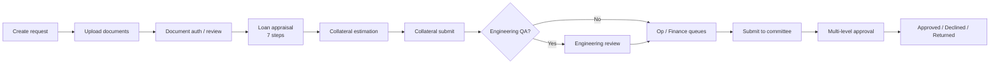

# DECSI Loan Hub

A Django-based **loan application and processing platform** built for microfinance institutions. It digitizes the end-to-end MSME loan lifecycle—from branch intake and document verification through cashflow-based appraisal, collateral field valuation, and multi-level credit committee approval.

The system is designed around **DECSI** (Dedebit Credit and Savings Institution) operational practices: branch → district → head-office workflows, construction-based building valuation catalogs, and alignment with the bank's Excel appraisal workbook.

---

## Table of contents

- [Overview](#overview)
- [Key features](#key-features)
- [Technology stack](#technology-stack)
- [Architecture](#architecture)
- [User roles](#user-roles)
- [Loan lifecycle](#loan-lifecycle)
- [Collateral valuation](#collateral-valuation)
- [Loan appraisal](#loan-appraisal)
- [Document authentication](#document-authentication)
- [Credit committee workflow](#credit-committee-workflow)
- [Project structure](#project-structure)
- [Getting started](#getting-started)
- [Environment variables](#environment-variables)
- [Management commands](#management-commands)
- [Running tests](#running-tests)
- [CI/CD](#cicd)

---

## Overview

DECSI Loan Hub replaces manual queuing, incomplete document submissions, and sequential paper-based approvals with a centralized web application. Staff at branches, districts, and head office work from role-specific dashboards. Loan officers complete a **seven-step cashflow appraisal** (mirroring the bank's Excel tool), engineers or officers perform **GPS-backed collateral field visits**, and configurable **approval committees** route loans by amount and organizational level.

The platform complements existing core banking (e.g. Temenos) and can integrate with external customer lookup APIs for identity verification.

---

## Key features

| Area | Capabilities |
|------|-------------|
| **Loan intake** | Create loan requests, assign loan officers, track status across branches and districts |
| **Documents** | Configurable document types, upload/review workflow, OCR (English + Amharic), content validation, reference-sample matching, identity field checks |
| **Appraisal** | Seven-step MSME cashflow appraisal: basic info, qualitative assessment, cashflow/DSCR, E&S checklist, collateral worksheet, summary/decision, repayment schedule |
| **Collateral** | Building valuation (DECSI construction catalog), land valuation, other movable collateral, field photos with GPS, map views, coverage ratio checks |
| **Governance** | Collateral lock after submit, audit trail, unlock-request workflow, engineering QA queue |
| **Approvals** | Operation/finance manager queues, configurable multi-level credit committees (branch → district → HO → management), in-app and optional email notifications |
| **Administration** | Geography (region/zone/city), branches, loan categories, collateral types, users, bulk CSV imports |
| **Reporting** | Loan request reports and filtering |

---

## Technology stack

| Layer | Technology |
|-------|------------|
| Backend | Python 3.9, Django 3.2 |
| Database | PostgreSQL 16 |
| Frontend | Django templates, jQuery, custom CSS/JS (including Leaflet maps for collateral) |
| Document processing | Tesseract OCR (`eng` + `amh`), Pillow, pypdf, pdf2image |
| Data import/export | pandas, django-import-export, openpyxl |
| API (optional) | Django REST Framework, drf-yasg, SimpleJWT |
| Deployment | Docker, Docker Compose |

---

## Architecture

```
┌─────────────────────────────────────────────────────────────────┐
│                        Web browser (staff)                       │
└────────────────────────────┬────────────────────────────────────┘
                             │
┌────────────────────────────▼────────────────────────────────────┐
│  Django application (decsi_loan)                                 │
│  ┌──────────────────┐  ┌────────────────────────────────────┐   │
│  │   loans app      │  │   collateral app                    │   │
│  │  • Loan requests │  │  • Building/land/other valuation   │   │
│  │  • Appraisal     │  │  • Field visits & GPS photos         │   │
│  │  • Documents     │  │  • Unit price catalog              │   │
│  │  • Committees    │  │  • Policy, governance, evidence pack│   │
│  └──────────────────┘  └────────────────────────────────────┘   │
└────────────────────────────┬────────────────────────────────────┘
                             │
              ┌──────────────┼──────────────┐
              ▼              ▼              ▼
        PostgreSQL      Media files    External APIs
        (loan data)     (uploads)      (core banking / OCR)
```

Two Django apps share the `LoanRequest` model as the central entity:

- **`loans`** — application intake, documents, appraisal, approvals, notifications, master data
- **`collateral`** — physical collateral estimation, field capture, engineering QA, evidence packs

---

## User roles

| Role | Typical responsibilities |
|------|------------------------|
| `superadmin` / `admin` | System configuration, user management, policy settings |
| `branch_manager` | Create loan requests, assign officers, send to engineering, submit to committee |
| `loan_officer` | Upload documents, complete appraisal, collateral estimation (when configured) |
| `engineering_head` | Receive collateral assignments, assign engineers, engineering QA oversight |
| `engineer` | Building valuation, unit prices, field visits, engineering QA review |
| `operation_manager` / `finance_manager` | Queue-based loan approvals |
| `district_manager` | District-level oversight |
| `credit_committee` / `ceo` / `vp` / `board_member` | Committee voting at configured approval levels |
| `accountant` | Branch-level committee participation |
| `risk_compliance` / `auditor` | Review and audit access |

Roles are defined on the custom `CustomUser` model (`loans.CustomUser`) and drive URL access and dashboard routing.

---

## Loan lifecycle



1. **Intake** — Branch staff create a `LoanRequest` with applicant details, category, collateral type, and amount.
2. **Documents** — Required document types are uploaded; automated checks run (file integrity, OCR, phrase matching, optional identity match).
3. **Appraisal** — Assigned loan officer completes sheets 1–7 (see [Loan appraisal](#loan-appraisal)).
4. **Collateral** — Depending on `CollateralEstimationConfig`, a loan officer or engineer estimates building/land/other collateral with field photos and GPS.
5. **Submit & lock** — Collateral is submitted and locked; an unlock workflow exists for corrections.
6. **Engineering QA** — When engineering-team mode is enabled, submitted collateral enters an engineering review queue.
7. **Manager queues** — Operation and finance managers approve from their respective queues.
8. **Committee** — Branch manager submits to the credit committee; loans route through configurable approval levels based on amount.
9. **Decision** — Approved, declined, or returned to the loan officer for rework.

---

## Collateral valuation

Collateral estimation supports three asset classes:

### Buildings

- Valuation follows the **DECSI construction catalog**: `MainWork` → `SubWork` → `SubSubWork`
- **Unit prices** are set per woreda (`City`) by the engineering team
- Each building has quantity × unit price rows, site GPS, and categorized field photos (front, side, roof, etc.)

### Land

- Size (m²) × unit price per m², with dedicated field-visit steps and photos

### Other collateral

- Movable items (vehicles, equipment, etc.) with estimated value and field capture

### Field-work policy

Bank-wide rules (`CollateralPolicyConfig`) govern:

- Minimum photos per building/land/other item
- GPS accuracy thresholds and officer attestation when signal is weak
- Maximum distance between photo GPS and registered site
- Collateral coverage ratio (collateral value ÷ loan amount)
- Declared-address vs. site GPS distance checks

### Governance (Tier 1)

- Records are **locked after collateral submit**
- Full **audit log** (`CollateralFieldAuditLog`) of field actions
- **Unlock requests** — officers request corrections; supervisors approve/reject
- **Evidence pack** — read-only bundle for committee review (totals, maps, photos, audit trail)

### Engineering QA (Tier 2)

When `CollateralEstimationConfig.mode` includes the engineering team, submitted collateral enters an engineering QA queue for head/engineer review before proceeding.

---

## Loan appraisal

The appraisal module mirrors the Excel workbook documented in `presentation/LOAN_APPRAISAL_EXCEL_STRUCTURE.md`:

| Step | Sheet | Content |
|------|-------|---------|
| 1 | Basic Info | Client, business, loan request details |
| 2 | Business & Character | Credit history, 10 qualitative factors (pass threshold ~75%) |
| 3 | Cashflow Analysis | Income statement, balance sheet, monthly cashflow, DSCR, repayment capacity |
| 4 | E&S Assessment | Environmental & social checklist (21 items), risk category, eligibility |
| 5 | Collateral Worksheet | Immovable, movable, guarantors; total value and coverage |
| 6 | Summary & Decision | Key indicators, decision factors, approve/decline recommendation |
| 7 | Repayment Schedule | Amortization parameters and schedule |

Appraisal data is stored in `LoanAppraisal` and related models. Sheet completeness policies can gate progression to collateral or committee submission.

---

## Document authentication

Each `LoanApplicationDocumentType` can be configured with:

- Allowed file extensions and max size
- **OCR text extraction** (Tesseract, `eng+amh`)
- **Content validation** — required phrases or similarity against a reference sample PDF
- **Identity matching** — applicant name, phone, TIN, business name against OCR text
- **Field extraction mappings** — auto-fill appraisal fields from document text
- Officer verification and optional external ID checks via core banking API

Documents progress through statuses: `pending` → `auto_passed` / `needs_review` → `verified` / `rejected`.

---

## Credit committee workflow

Approval committees are fully configurable in Django admin:

- **`ApprovalCommitteeLevel`** — ordered levels (e.g. branch, district, head office, CEO) with amount thresholds
- **`ApprovalCommitteeMemberRule`** — who may vote at each level (by role or named user)
- **`BranchCommitteeOverride`** — per-branch committee composition at the branch level
- **`LoanApprovalLevelProgress`** — per-loan tracking of each level's status

The routing engine (`loans/committee.py`) selects applicable levels based on the recommended or requested loan amount. Committee members cast votes; loans can be approved, declined, or returned to the loan officer. In-app notifications (and optional email) keep participants informed.

---

## Project structure

```
decsi_loan/
├── decsi_loan/          # Django project settings, URLs, WSGI
├── loans/               # Core loan app
│   ├── models.py        # Users, loan requests, appraisal, committees, documents
│   ├── views.py         # Loan workflows, admin screens, reports
│   ├── committee.py     # Multi-level approval engine
│   ├── services/        # Document auth, notifications, customer API, prefill
│   └── migrations/
├── collateral/          # Collateral valuation app
│   ├── models.py        # Buildings, catalog, land, other, policy, audit
│   ├── views.py         # Valuation UI, field visits, catalog management
│   ├── tier1_views.py   # Policy config, unlock queue, evidence pack
│   ├── tier2_views.py   # Engineering QA
│   ├── governance.py    # Lock, audit, GPS attestation
│   ├── coverage.py      # Collateral coverage calculations
│   └── tests/
├── management/commands/ # Bulk import commands (users, branches, zones, etc.)
├── templates/         # Django HTML templates
├── static/            # CSS, JS (collateral maps, field capture)
├── presentation/      # Appraisal Excel reference docs and proposal slides
├── media/             # Uploaded documents and collateral photos
├── docker-compose.yml
├── Dockerfile
├── requirements.txt
└── manage.py
```

---

## Getting started

### Prerequisites

- Docker and Docker Compose, **or**
- Python 3.9+, PostgreSQL 16, and system packages for OCR (`tesseract-ocr`, `tesseract-ocr-eng`, `tesseract-ocr-amh`, `poppler-utils`)

### Run with Docker Compose (recommended)

```bash
# Clone the repository and enter the project directory
cd decsi_loan

# Build and start web + database
docker compose up --build

# In another terminal, run migrations (first time)
docker compose exec web python manage.py migrate

# Create a superuser
docker compose exec web python manage.py createsuperuser
```

The application is available at **http://localhost:8000**.

#### HTTPS for tablets (GPS / camera on LAN)

Phones and tablets block geolocation on plain `http://192.168.x.x`. For field testing on the LAN:

```bash
./scripts/gen_field_https_certs.sh          # self-signed cert + CSRF origins for your LAN IP
docker compose -f docker-compose.yml -f docker-compose.https.yml up --build
```

Open **https://YOUR-LAN-IP:8443** on the tablet (accept the certificate warning once). Laptop GPS testing can stay on **http://localhost:8000**. In-app steps: **Collateral → Tablet field checklist**.

Default database credentials (from `docker-compose.yml`):

| Variable | Default |
|----------|---------|
| `POSTGRES_DB` | `decsiloandb` |
| `POSTGRES_USER` | `decsiloandbuser` |
| `POSTGRES_PASSWORD` | `decsiloandbpassword` |

### Run locally (without Docker)

```bash
python -m venv .venv
source .venv/bin/activate
pip install -r requirements.txt

# Configure PostgreSQL and set environment variables (see below)
export DB_HOST=localhost
python manage.py migrate
python manage.py createsuperuser
python manage.py runserver
```

### Initial data

Use Django admin (`/admin/`) or management commands to load master data:

```bash
python manage.py import_zones <file>
python manage.py import_branches <file>
python manage.py import_loan_categories <file>
python manage.py import_users <file>
python manage.py import_loan_requests <file>
python manage.py import_collaterals <file>
```

Configure singleton records in admin:

- **Collateral estimation config** — who performs collateral (loan officer, engineering team, or both)
- **Collateral policy config** — field-work rules (photos, GPS, coverage)
- **Document authentication policy** — global upload defaults
- **Approval committee levels** — multi-level approval routing

---

## Environment variables

Create a `.env` file in the project root (or set variables in your deployment environment):

| Variable | Description | Default |
|----------|-------------|---------|
| `SECRET_KEY` | Django secret key | `default_secret_key` |
| `DEBUG` | Debug mode (`True` / `False`) | `False` |
| `DB_NAME` | PostgreSQL database name | `decsiloandb` |
| `DB_USER` | PostgreSQL user | `decsiloandbuser` |
| `DB_PASSWORD` | PostgreSQL password | `decsiloandbpassword` |
| `SITE_URL` | Base URL for notification links | `http://localhost:8000` |
| `DEFAULT_FROM_EMAIL` | Sender address for emails | `noreply@decsi.local` |
| `EMAIL_BACKEND` | Django email backend | Console backend |
| `EMAIL_HOST` / `EMAIL_PORT` / `EMAIL_HOST_USER` / `EMAIL_HOST_PASSWORD` / `EMAIL_USE_TLS` | SMTP settings | — |
| `DOCUMENT_OCR_LANG` | Tesseract language packs | `eng+amh` |

> **Note:** When running with Docker Compose, the database host is `db` (set in `settings.py`). For local development without Docker, override `HOST` in database settings or set `DB_HOST=localhost`.

---

## Management commands

| Command | Purpose |
|---------|---------|
| `import_zones` | Import region/zone/city geography from CSV |
| `import_branches` | Import branches and districts |
| `import_loan_categories` | Import loan product categories |
| `import_users` | Bulk-create users with roles |
| `import_loan_requests` | Import historical loan requests |
| `import_collaterals` | Import collateral catalog data |

---

## Running tests

```bash
# All tests
python manage.py test

# Collateral module tests
python manage.py test collateral.tests

# Specific suites
python manage.py test collateral.tests.test_governance
python manage.py test collateral.tests.test_tier1
python manage.py test collateral.tests.test_tier2
python manage.py test loans.tests
```

With Docker:

```bash
docker compose exec web python manage.py test
```

---

## CI/CD

GitHub Actions (`.github/workflows/docker-image.yml`) builds the Docker image on every push and pull request to `main`.

---

## Related documentation

| File | Description |
|------|-------------|
| `presentation/LOAN_APPRAISAL_EXCEL_STRUCTURE.md` | Excel workbook structure mapped to Django models |
| `presentation/LOAN_APPRAISAL_EXCEL_DATA.md` | Detailed field-level Excel data reference |
| `presentation/SHEET2_DROPDOWNS_AND_SHEET3_ANALYSIS_PLAN.md` | Sheet 2 dropdowns and Sheet 3 cashflow analysis plan |
| `presentation/loan_application_proposal.html` | Original project proposal and DECSI case study |

---

## License

Proprietary — DECSI / internal use. Contact the project maintainers for licensing inquiries.
