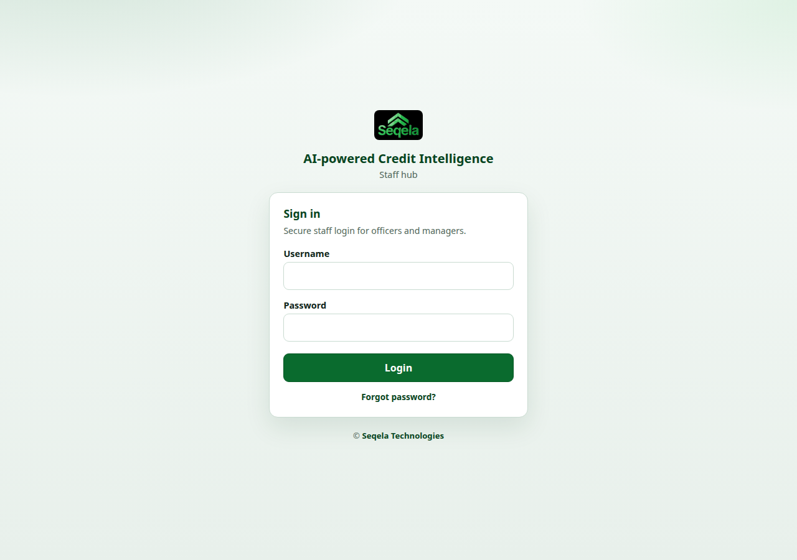

# Staff User Manual

**Audience:** Branch, district, head-office, engineering, finance, risk, and committee users.  
**Entry:** `/hub/login/` — product brand in the hub: *AI-powered Credit Intelligence*.

Borrower self-service is covered in the [Customer manual](03_customers.md). Platform configuration is in the [Admin manual](01_admin.md).

---

## 1. Getting started

### 1.1 Sign in

1. Go to `/hub/login/`.
2. Enter username and password.
3. Complete MFA if prompted (`/hub/mfa/verify/`).
4. You land on the Credit Intelligence / hub home for your role.

> **Screenshot (H-01):** Staff login — enter username and password for AI-powered Credit Intelligence.
>
> 
>
> **Screenshot (H-04):** Hub home — role-scoped KPIs and shortcuts after sign-in.
>
> **Screenshot (H-05):** Header — Notifications, Help, Delegations, and Logout sit beside your name and role.

**Forgot password:** `/hub/password-reset/` (email link).  
**Change password while logged in:** `/hub/password-change/`.  
**MFA setup:** `/hub/mfa/setup/`.  
**Delegations:** `/hub/delegations/`.  
**Help / PDF:** `/hub/help/`.

If your account is locked after failed attempts, contact an administrator or IT.

### 1.2 What you see depends on your role

Menus are role-scoped. Examples:

| Role | Typical menus |
|------|----------------|
| Branch Manager | Loan requests, Collateral, Approval queue, Post-approval, Notifications, Reports, Unlock, **Delegations** |
| Loan Officer | Loan requests, documents, appraisal, collateral (when allowed), **Delegations** |
| Cooperative Manager | Cooperative queue, Approval / Post-approval, Collateral, Reports, **Delegations** |
| Credit Loan Officer / Credit Head | HO loans, committees (head), oversight, **Delegations** |
| Finance Manager | Disbursement queue, Approval / Post-approval, Reports, **Delegations** |
| Accountant / District Manager / Exec / Board | Approval queue, Committee loans, Reports, **Delegations** |
| Engineer / Engineering Head | Catalog, Unit prices, Collateral, Engineering QA, Unlock (head), **Delegations** |
| Risk / Auditor | Reports, review, security audit (when permitted), **Delegations** |
| Admin / Superadmin | Settings, checkup, **approve Delegations**, audit |

Always work only on loans in **your branch / district / department** scope. When covering a colleague, a green banner shows **Acting by delegation**.

---

## 2. Loan lifecycle (happy path)

```text
Create / receive request
    → Assign loan officer (if needed)
    → Cooperative intake (branch)
    → Documents (+ authentication)
    → Appraisal (steps 1–7)
    → Collateral (+ optional engineering QA)
    → Submit to committee → Vote
    → Post-approval (conditions → schedule → ready)
    → Finance disbursement → Disbursed
```

Keep the **Queue ID** (for example `HK-000000001`) in emails, calls, and notes.

### Sources of loans

| Source | How it enters the hub |
|--------|------------------------|
| Branch / HO staff | **Add loan request** (or Agentic Assist draft for eligible roles); `source_channel` = staff/branch |
| Digital Apply | Customer submit mints a loan with **`source_channel=online`**; appears in **Online loan intake** and **Notifications**; may **auto-assign** LO (or BM) at the branch |

---

## 2.1 Authority delegation

Use **Delegations** when you need a colleague to cover you (leave, travel, overload).

1. Open **Delegations** (`/hub/delegations/`).  
2. Request cover: choose **delegate**, **scopes** you already hold, start/end time, and reason.  
3. Wait for **admin approval** (Pending → Approved / Rejected).  
4. While approved, the delegate sees **Acting by delegation** and can perform those scopes.  
5. Principal or admin can **Revoke** early.

| Scope | What the delegate can do |
|-------|---------------------------|
| Committee voting | Cast votes as the principal |
| Cooperative intake | Approve/reject branch intake |
| Appraisal / documents | Work as assigned loan officer |
| Finance disbursement | Finance disbursement approval |
| Assign loan officer | BM / DM / Credit Head assignment powers |

Actions are audited as *acted by delegate for principal*. Do not share passwords — use delegation instead.

> **Screenshot (H-23):** Delegations — request cover and (for admins) Approve / Reject.

---

## 3. Role playbooks

### 3.1 Branch Manager

1. **Create** a loan request (customer number lookup when available).
2. **Assign** a loan officer.
3. Ensure **Cooperative** intake is completed for branch loans.
4. Monitor officer progress (documents, appraisal, collateral).
5. If engineering mode applies: send to engineering / follow unlock needs.
6. **Submit to committee** when the file is ready.
7. Track **Post-approval** until finance can disburse.

Also: respond to unlock requests when collateral is locked incorrectly.

### 3.2 Loan Officer

1. Open the assigned loan from **Loan requests**.
2. **Upload / review documents** against the product checklist.
3. Complete **appraisal** steps (MSME cashflow or corporate mode).
4. Capture **collateral** evidence when your estimation mode allows it.
5. Respond if committee **returns** the file for corrections.
6. Support post-approval document or condition follow-ups as asked.

Document authentication may show statuses such as pending, needs review, verified, or rejected — clear exceptions before committee.

### 3.3 Cooperative Manager

1. Open **Cooperative queue**.
2. Review new branch requests (including online intake).
3. **Approve into queue** when the request is acceptable for officer work.
4. Escalate incomplete or suspicious files per branch procedure.

Until intake approval, officers may be blocked from progressing branch loans.

### 3.4 Credit Loan Officer / Credit Department Head

- **Credit LO:** Create and process **HO Credit** loans (“Add HO loan”), appraisal, and related queues.
- **Credit Head:** Oversight of HO credit work and **approval committee** configuration (with admin).

### 3.5 Committee voters

(CEO, VPs, board members, accountants, district managers, and other configured members)

1. Open **Approval queue** or **Committee loans**.
2. Review appraisal pack / evidence (Excel or PDF packs when available).
3. **Cast vote** (approve / decline / follow return workflow as offered).
4. Do not rely on Agentic Assist for a binding decision — the assistant cannot approve.

Committee statuses you will see: Not submitted → Pending → Approved / Declined / Returned to loan officer.

### 3.6 Post-approval workers

After committee **Approved**:

1. Open **Post-approval** queue / detail.
2. Clear **conditions**.
3. Confirm **repayment schedule**.
4. Mark **ready** for disbursement when complete.

Disbursement track statuses include: Not started → Awaiting conditions → Schedule confirmed → Ready → Disbursed.

### 3.7 Finance Manager

1. Open **Disbursement queue**.
2. Verify readiness and any CBS / ledger checks your site uses.
3. Approve disbursement steps and ensure the loan is marked **Disbursed** when funds are released.

### 3.8 Engineering Head / Engineer

| Role | Tasks |
|------|--------|
| **Engineering Head** | Catalog & unit prices oversight, assign engineers, Engineering QA, unlock queue |
| **Engineer / Valuer** | Field valuation, GPS photos, building/land/other estimates, submit for QA |

Typical path: loan sent for collateral → assign engineer → field work → submit/lock → **Engineering QA** approve or return.

### 3.9 Risk, Auditor, Management

- Use **Reports**, dashboards, and (where allowed) **Security audit**.
- Review portfolio health via **Credit Intelligence** (Overview, Insights, Officer/Manager, Portfolio, Collateral).

---

## 4. Core screens (how-to)

### 4.1 Create a loan request

1. Choose **Add loan request** (or HO equivalent).
2. Enter customer / party details (customer number lookup when enabled).
3. Select **loan category**, amount, branch, collateral type as required.
4. Save — note the **Queue ID**.
5. Assign a loan officer if you are a manager.

> **Screenshot (H-08):** Create loan request — capture customer number, product, amount, and branch.
>
> **Screenshot (H-07):** Loan requests — open a Queue ID to continue documents, appraisal, or collateral.

### 4.2 Online loan intake

1. Open **Online loan intake** (`/hub/online_loan_intake/` — Settings nav for superuser; others may open the URL or use **Notifications**).  
2. Find **submitted** Digital Apply loans and open **drafts** if you need to assist.  
3. Search by Queue ID, name, phone, or customer number.  
4. Continue the same lifecycle as branch-created loans (cooperative → LO → …).  
5. Confirm officer assignment (auto-assign may already have set an LO).

Customers also get in-portal **Notices** when you accept intake or when credit is decided.

### 4.3 Documents

1. Open the loan → document upload / checklist screen.  
2. Upload each required type for the **document pack** (or global fallback).  
3. Review automated authentication results; fix or re-upload rejects.  
4. Use **Request document** when a missing type must be supplied by BM/uploaders.  
5. Keep files readable (scan quality matters for OCR).

### 4.4 Appraisal

1. Open appraisal for the loan.
2. Complete **steps 1–7** for MSME or corporate mode.
3. Address scorecard / policy gate warnings before committee.
4. Export appraisal pack (Excel/PDF) when preparing committee materials.
5. Sheet 7 / post-approval amortization feeds the customer **Repayment schedule** in Digital Apply after credit approval.

### 4.5 Collateral

1. Open collateral for the loan.
2. Capture buildings, land, or other items per catalog and **unit prices** for the woreda (market price bands may inform suggestions).
3. Record field visit evidence (GPS / photos) per policy.
4. Submit estimation (locks when configured).
5. If locked in error, request unlock via the unlock workflow; managers / eng head process the **Unlock queue**.

### 4.6 Committee

1. Eligible role submits the loan to committee.  
2. Members vote from the approval worklist (or via **approved delegation**).  
3. On **Returned to loan officer**, LO corrects and resubmits (customer status stays “in progress”).  
4. On **Approved**, move to post-approval and confirm schedule so the customer can view it online; on **Declined**, close per policy.

### 4.7 Notifications and reports

- **Notifications** — assignments, returns, queue events, **online intake** submissions.  
- **Reports / Dashboard** — scoped to your branch or district.  
- **Credit Intelligence** — KPIs and risk views for managers.  
- **Delegations** — pending approval count for admins; “Acting by…” for delegates.

---

## 5. Agentic Assist

Floating chat and `/hub/agent/` help staff draft and look up information.

**Can help with:** drafting a loan story, creating a request (when role allows), listing document needs, reading appraisal summaries.

**Cannot:** approve loans, value collateral, or disburse funds. All policy gates remain with human roles.

---

## 6. Security good practice

- Never share passwords or MFA codes — use **Delegations** for cover.  
- Lock your workstation; the hub may idle-timeout sessions.  
- Use official email for password reset only.  
- Report suspicious unlock, vote, or delegation activity to IT / risk.

---

## 7. Status cheat sheet

| Area | Values you will see |
|------|---------------------|
| Committee | Not submitted, Pending, Approved, Declined, Returned to loan officer |
| Disbursement | Not started, Awaiting conditions, Schedule confirmed, Ready, Disbursed |
| Delegation | Pending → Approved / Rejected; Revoked |
| Source channel | Online (Digital Apply) vs staff/branch entry |
| Customer-visible pipeline | Submitted → Branch intake → Loan processing → Credit decision → Disbursement prep → Disbursed (+ repayment schedule when approved) |

---

## 8. Troubleshooting

| Problem | What to try |
|---------|-------------|
| Missing menu | Confirm your **role** and **branch/district** with admin |
| Cannot edit collateral | Estimation may be **locked** — use unlock queue |
| Cannot progress branch loan | Check **Cooperative queue** approval |
| Documents incomplete | Open category **document pack**; upload or **Request document** |
| MFA / lockout | Contact admin; use password reset if email works |
| Online application missing | Confirm customer **submitted** (not draft); check Notifications / Online loan intake |
| Cannot act for colleague | Delegation must be **Approved** and inside the date window |
| Customer has no schedule | Complete post-approval amortization after committee **Approved** |

---

## 9. Related manuals

- [Admin user manual](01_admin.md)  
- [Customer user manual](03_customers.md)  
- [Market partners](04_market_partners.md)  
- [Screenshots](05_screenshots.md)  
- [Manual index](README.md) · [Printable HTML pack](DECSI_Loan_Hub_User_Manuals.html)
