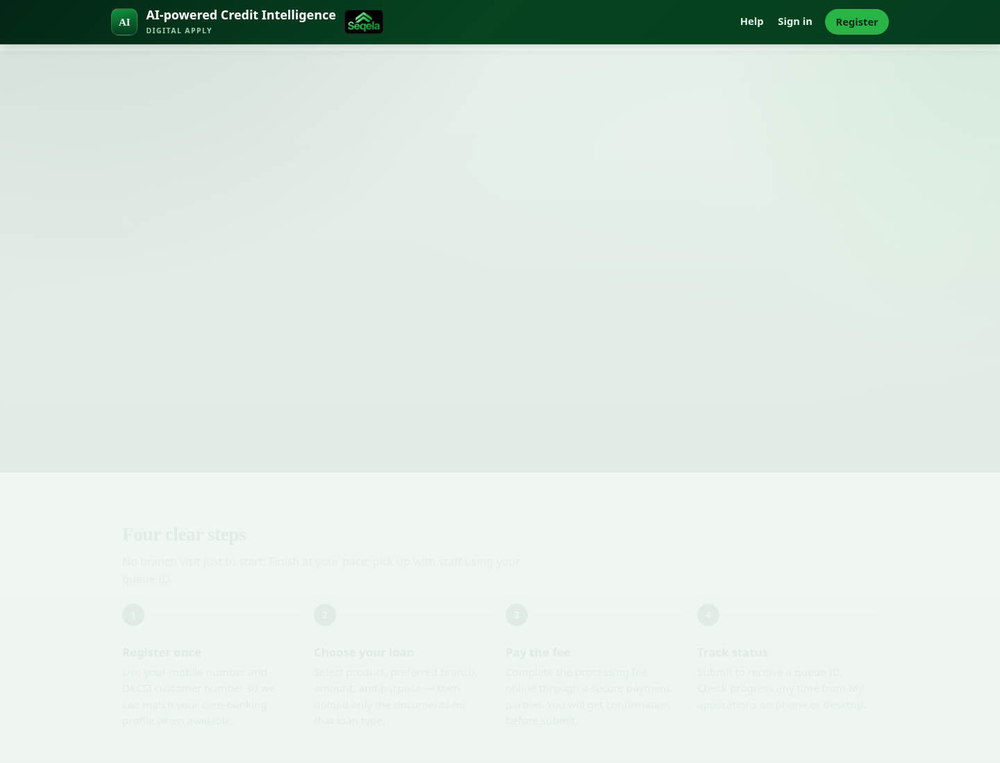
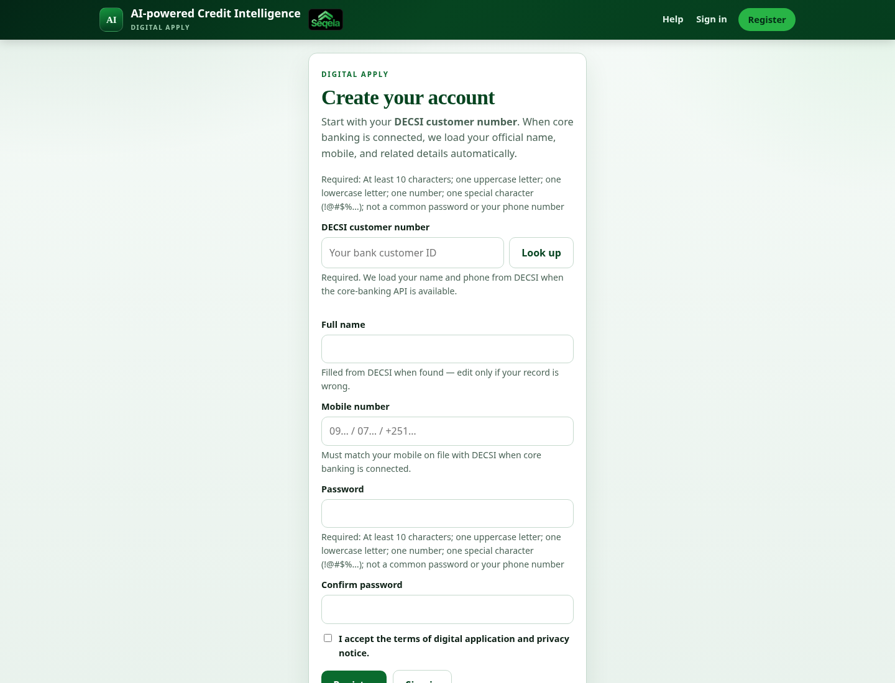
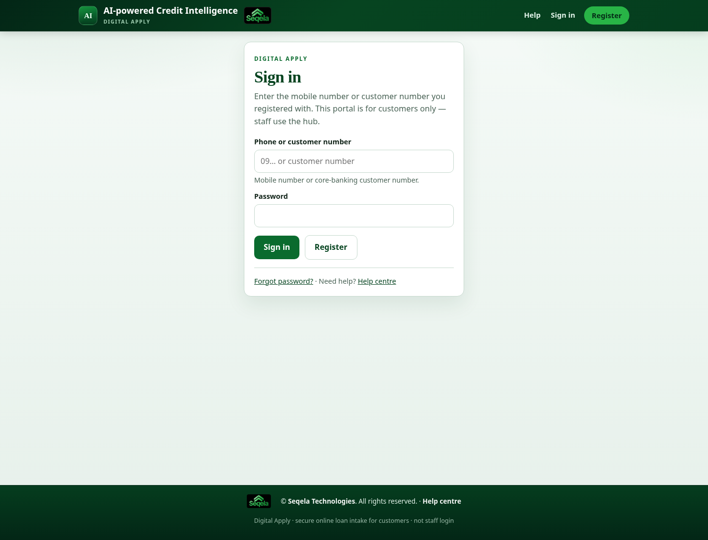
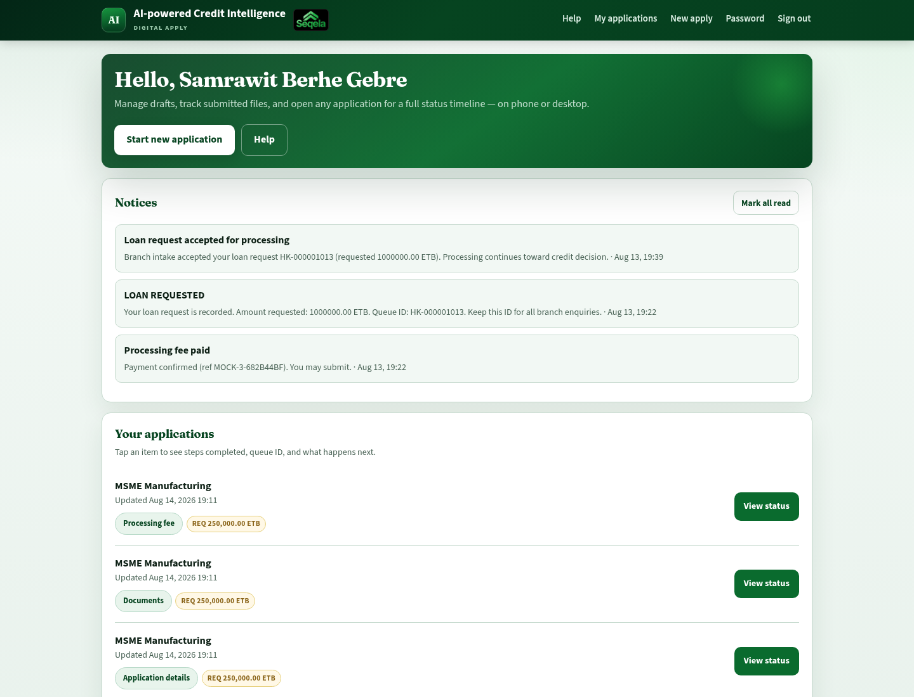
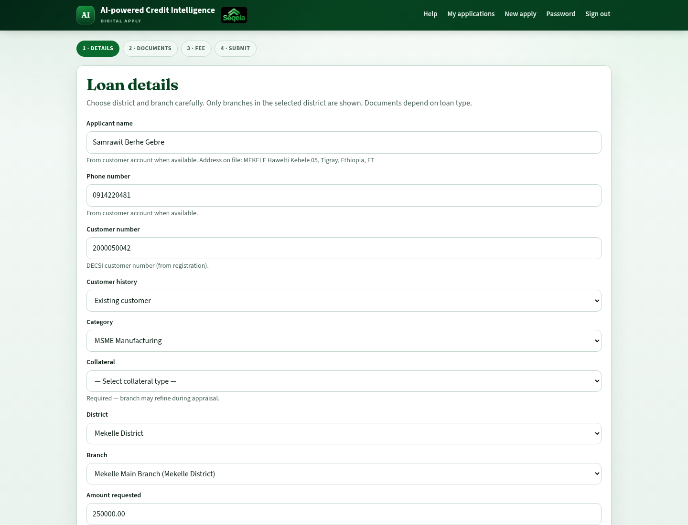
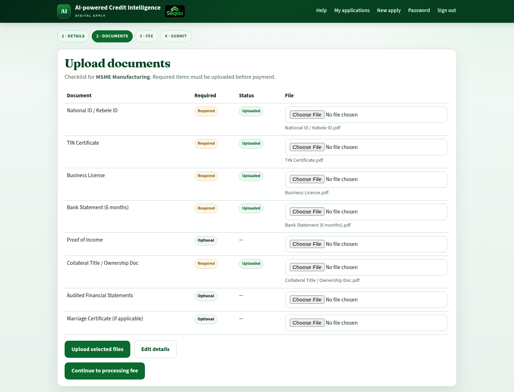
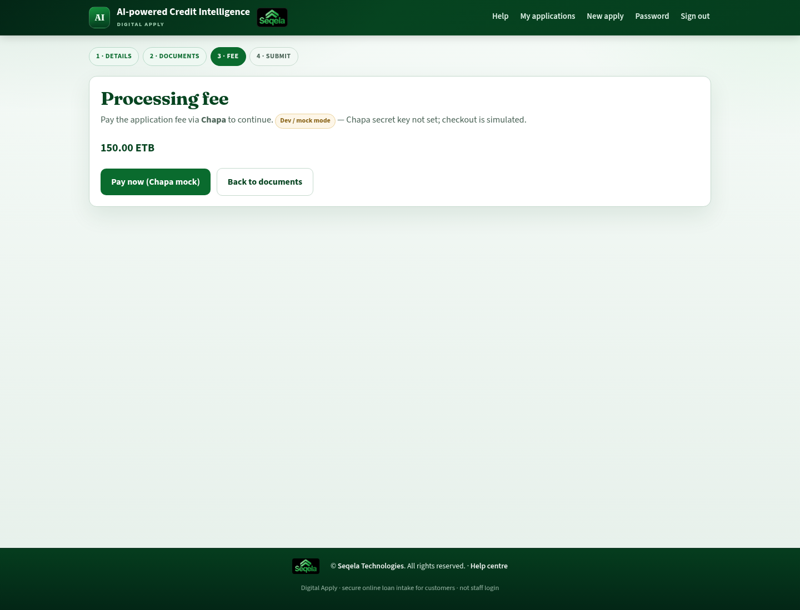
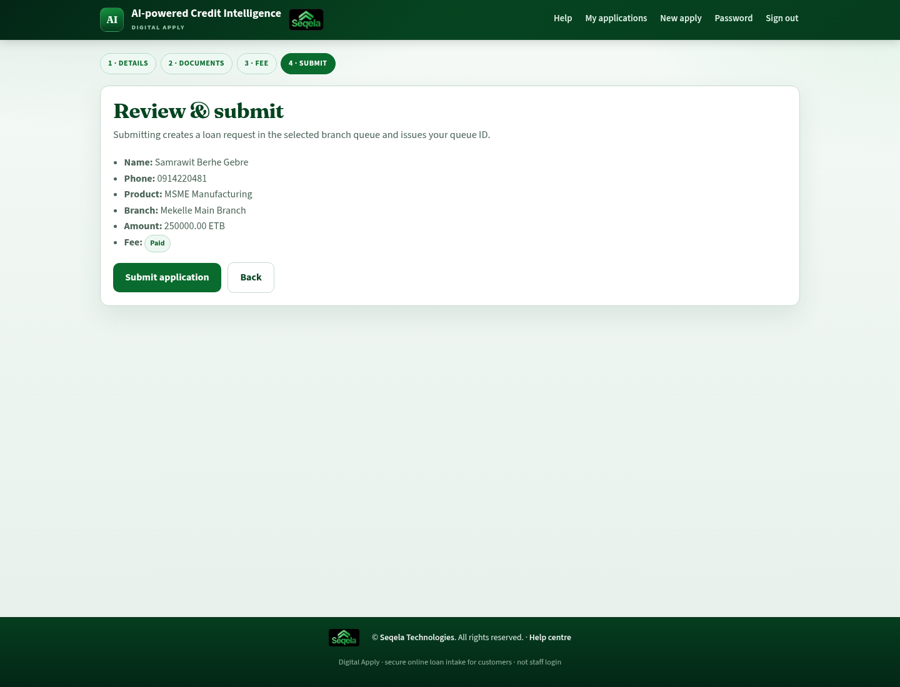
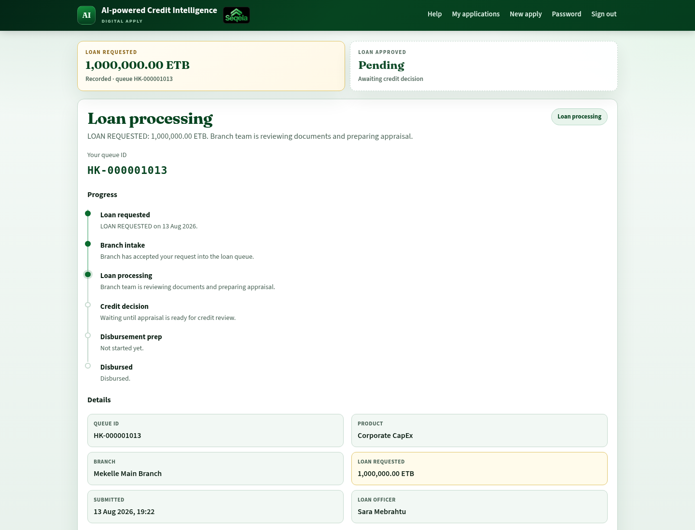
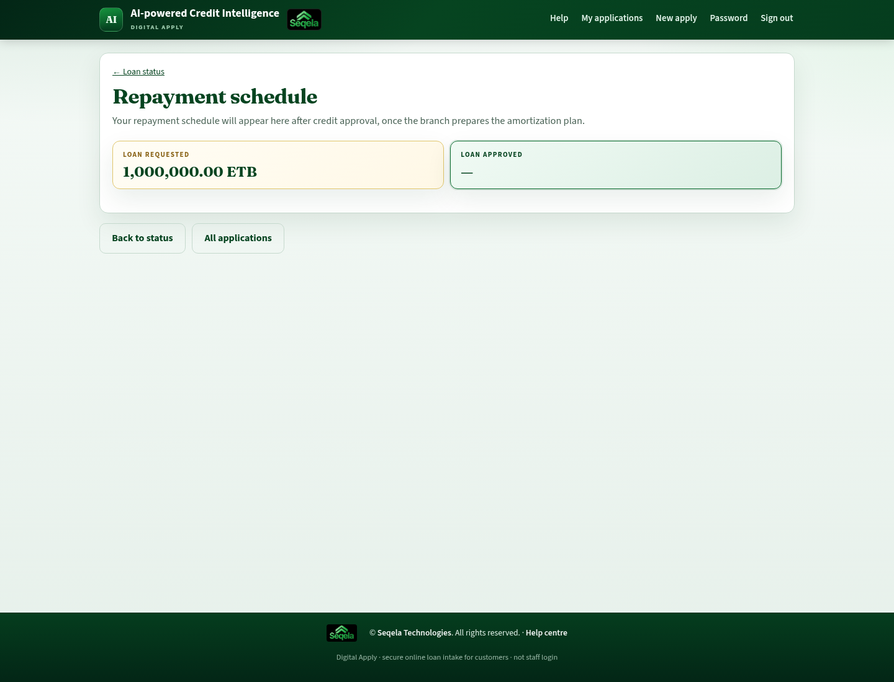

# Customer User Manual — Digital Apply

**Audience:** DECSI customers applying for a loan online.  
**Entry:** Digital Apply home at `/` (public portal).  
**Brand:** *Digital Apply* on *AI-powered Credit Intelligence*.

Staff processing after you submit is described for employees in the [Staff manual](02_staff.md). You do not need a staff hub account.

---

## 1. What Digital Apply does

You can:

1. Create an applicant account with your **DECSI customer number** and mobile phone.
2. Start a loan application: product, district/branch, amount, purpose, collateral type.
3. Upload the **documents required for that product**.
4. Pay the **processing fee** online (or skip if the fee is waived / zero).
5. Submit and receive a **Queue ID** (for example `HK-000000001`).
6. Track progress, read **Notices**, and — after credit approval — view your **Repayment schedule**.

If you see **“Digital apply is temporarily closed”**, the portal is offline for maintenance — visit your branch or try again later.

---

## 2. Create an account

1. Open the Digital Apply home page.
2. Choose **Create account**.
3. Enter:
   - **DECSI customer number**
   - Full name
   - Mobile number
   - Password (follow the on-screen rules)
   - Accept terms if shown
4. Submit registration.

> **Screenshot (C-01):** Digital Apply landing — Create account or sign in to apply online.
>
> 
>
> **Screenshot (C-02):** Register — DECSI customer number, name, mobile, and password.
>
> 

Some deployments validate your customer number against DECSI records. If validation fails, confirm the number with your branch before retrying.

### Already registered?

Choose **I already have an account** and sign in with:

- **Mobile number** or **customer number**, and  
- Your **password**.

---

## 3. Sign in, password help, and security

| Task | How |
|------|-----|
| Sign in | `/login/` — phone or customer number + password |
| Sign out | Use logout from the portal menu |
| Forgot password | **Forgot password** → OTP sent to your registered phone → set a new password |
| Change password (signed in) | Account → change password |

> **Screenshot (C-03):** Sign in — mobile or customer number plus password.
>
> 

Tips:

- Use a strong unique password.
- Keep your phone available for OTP reset.
- Too many failed logins may temporarily lock the account — wait or contact your branch / support channel.

---

## 4. Apply for a loan (step by step)

From **My applications** / home, start a new application. The wizard shows four steps:

**1 · Details → 2 · Documents → 3 · Fee → 4 · Submit**

> **Screenshot (C-04):** My applications — Notices and submitted virtual loans with Queue ID.
>
> 
>
> **Screenshot (C-05):** Step 1 · Details — choose product, branch, amount, and purpose.
>
> 
>
> **Screenshot (C-06):** Step 2 · Documents — upload every required file for the product.
>
> 
>
> **Screenshot (C-07):** Step 3 · Fee — pay the processing fee (ETB) before submit.
>
> 
>
> **Screenshot (C-08):** Step 4 · Submit — review and submit to receive a Queue ID.
>
> 
>
> **Screenshot (C-09):** Status — keep your Queue ID for branch follow-up.
>
> 

### Step 1 — Details

1. Select **District**, then **Branch** (lists cascade).  
2. Select the **loan product** (loan category).  
3. Choose **collateral type** (required).  
4. Enter **amount**, **purpose**, and customer history (new / existing) if asked.  
5. Name, phone, and customer number come from your account (CBS may lock name/phone to the bank record).  
6. Save and continue.

You can leave a draft and return later until you submit.

### Step 2 — Documents

1. Upload each document listed for your product.
2. Required items must be complete before you continue.
3. Prefer clear scans or photos (all pages, readable text).

If a file is rejected, replace it with a clearer copy.

### Step 3 — Processing fee

1. Review the fee amount (ETB).  
2. If the fee is **0 ETB**, payment is **waived** and you continue without Chapa.  
3. Otherwise start payment (live Chapa, or a **demo/mock** checkout when the bank runs Digital Apply in test mode).  
4. Complete payment and wait for confirmation (statuses: unpaid → pending → paid / failed / waived).  
5. Do not close the browser until the portal confirms success.

If payment fails, retry from the Fee step or contact support with the time of the attempt. Do not submit until the fee is paid when the portal requires it.

### Step 4 — Submit

1. Review your details and documents.  
2. Confirm submit.  
3. Save your **Queue ID** immediately — you will also get a **Notice** (Loan requested).

After submit, the application enters the DECSI branch queue. Staff will continue documents review, appraisal, collateral, credit decision, and disbursement preparation.

### Withdraw a draft

Unsubmitted drafts can be cancelled/withdrawn from the application actions if shown (optional reason). Submitted applications are handled by the branch — visit the branch for withdrawal or cancellation requests.

---

## 5. Track your application

Open the application from **My applications** or the status page.

### Notices

On **My applications** you may see a **Notices** list (payment, loan requested + Queue ID, branch intake, credit approved/declined). Use **mark all read** when available.

> **Screenshot (C-14):** Notices — in-portal messages about your application (shown on My applications; see C-04 above).

### While drafting

You may see stages such as:

- Details  
- Documents  
- Fee  
- Submit  

Finish remaining steps to obtain a Queue ID.

### After submit

Typical pipeline:

| Stage | Meaning |
|-------|---------|
| **Submitted** | Received online; waiting in the branch queue (**Loan requested**) |
| **Branch intake** | Branch cooperative reviews your application |
| **Loan processing** | Officer reviews documents, collateral, and analysis |
| **Credit decision** | Credit approval process underway |
| **Disbursement prep** | Approved loan prepared for payment (**Loan approved** milestone when decided) |
| **Disbursed** | Funds released per DECSI records |

Status may show **requested amount** vs **approved amount/date** when credit has decided. If returned to the officer for corrections, the pipeline stays **in progress**.

Other outcomes you may see:

| Outcome | What it means |
|---------|----------------|
| **Not approved / Declined** | Credit review did not approve — visit your branch for details |
| **Closed / Rejected** | Request closed without approval — branch can explain |
| **Cancelled** | Draft cancelled before submit |

Always quote your **Queue ID** when calling or visiting the branch.

Status facts often include: product, branch, amount requested, submitted date, and assigned loan officer (when assigned).

### Repayment schedule

After **credit approval** (or disbursement), open **Repayment schedule** from the status page (`/apply/<id>/schedule/`).

- Read-only amortization prepared by the branch (Sheet 7 / post-approval).  
- If approved but the schedule is empty, the branch is still preparing it — check again later.  
- Confirm final figures with your branch at disbursement if anything differs.

> **Screenshot (C-13):** Repayment schedule — installment table after credit approval.
>
> 

### Loan agreement at the branch

Before funds are released, the branch may ask you to **sign the loan agreement** on a DECSI tablet or PC (draw your signature, confirm your name and ID). This is part of DECSI’s closing process together with collateral legal papers. You do **not** sign that agreement inside Digital Apply today — visit the branch when invited, and bring a valid ID.

---

## 6. What happens after you submit?

You do **not** complete appraisal or collateral online. DECSI staff:

1. Accept the request into the branch queue.  
2. Verify documents and run internal checks.  
3. Complete credit appraisal and collateral valuation as required.  
4. Send the file through credit committee.  
5. Complete post-approval: conditions, **repayment schedule**, collateral legal papers, and **loan agreement signatures**, then disburse if approved.  

Processing time depends on product, collateral, completeness of documents, and committee schedules. Your status page and **Notices** update as the loan moves forward.

---

## 7. Tips for a smooth application

- Use the correct **customer number** linked to your DECSI profile.  
- Choose the branch that normally serves you.  
- Upload **all required** documents before paying the fee.  
- Keep payment confirmation and **Queue ID** screenshots.  
- Respond quickly if the branch asks for clearer documents, a site visit, or **agreement signing**.  
- Bring a valid ID when invited to sign at the branch.  
- Do not share your password or OTP with anyone claiming to be DECSI support in unofficial channels.

---

## 8. Troubleshooting

| Problem | What to try |
|---------|-------------|
| Portal closed | Wait or visit the branch; Digital Apply may be temporarily disabled |
| Cannot register | Check customer number and phone; ask branch if CBS validation is required |
| OTP not received | Confirm phone number; wait and retry; contact branch if SMS is down |
| Payment stuck | Do not create duplicate applications immediately; retry Fee step or ask branch with timestamp |
| Fee skipped | Fee may be **0 / waived** — continue to Submit |
| No Queue ID | Application is still a draft — complete Fee and Submit |
| Status not moving | Normal for several days; contact branch with Queue ID if urgently delayed |
| No repayment schedule | Wait until after credit approval; branch may still be preparing amortization |
| Forgot which product | Open My applications — product and amount are listed on each card / status |

---

## 9. Privacy and support

- Your application data is processed by DECSI for credit assessment.  
- For account or status help, contact your **branch** with full name, customer number, and Queue ID.  
- Staff use a separate internal system; they will not ask for your Digital Apply password.

---

## 10. Related manuals

- [Staff user manual](02_staff.md) — how DECSI processes your file after submit
- [Admin user manual](01_admin.md) — for DECSI administrators only
- [Manual index](README.md) · [Printable HTML pack](DECSI_Loan_Hub_User_Manuals.html)
