# Screenshots

Real UI captures from DECSI Loan Hub used in this manual pack. Files live in `docs/user_manual/screenshots/`.

## Digital Apply (customers / virtual loan requests)


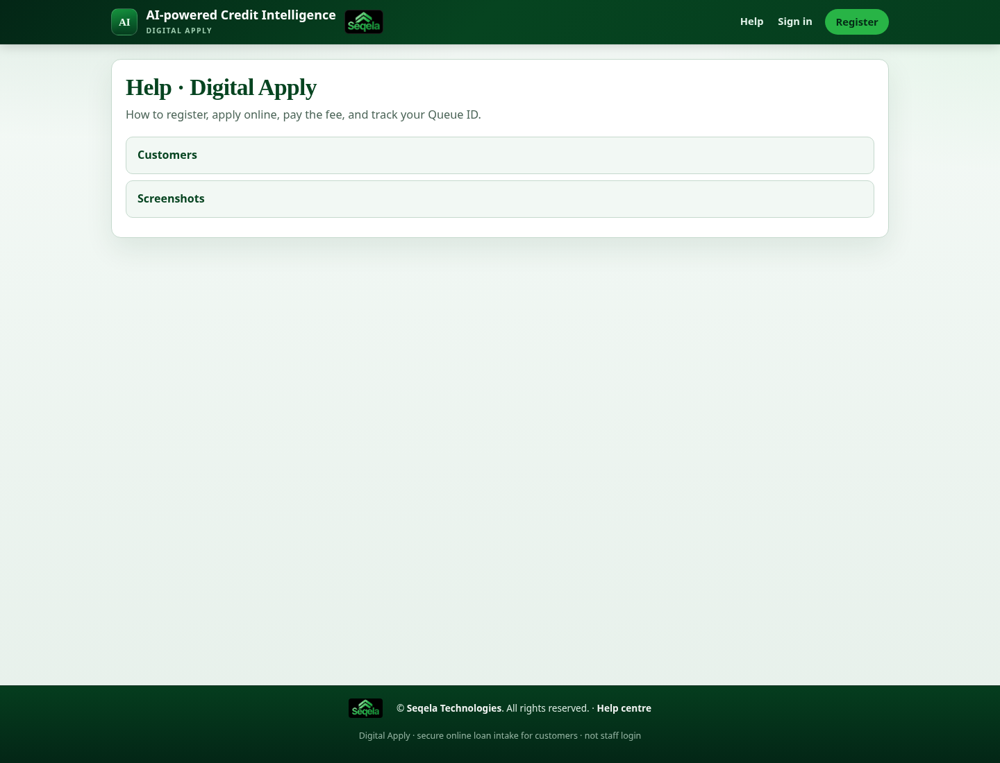


## Staff hub


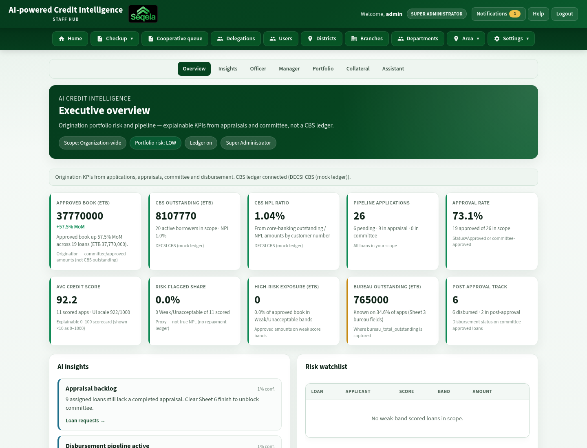

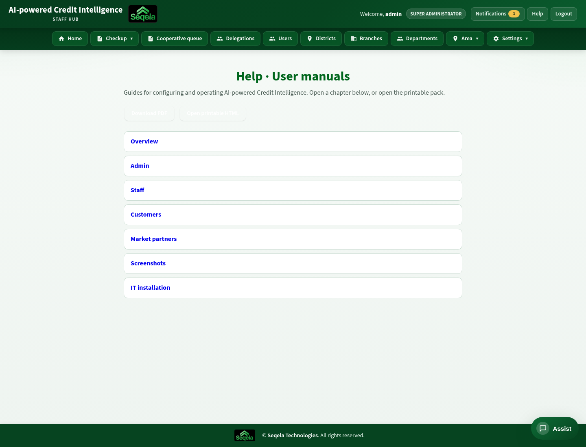

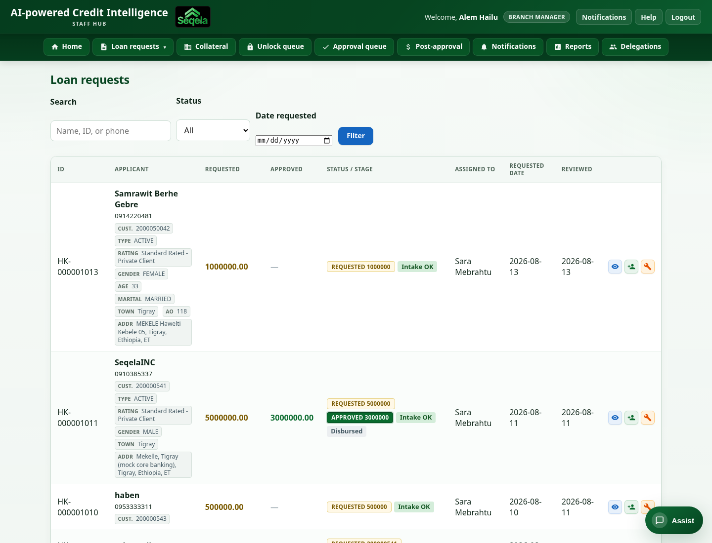

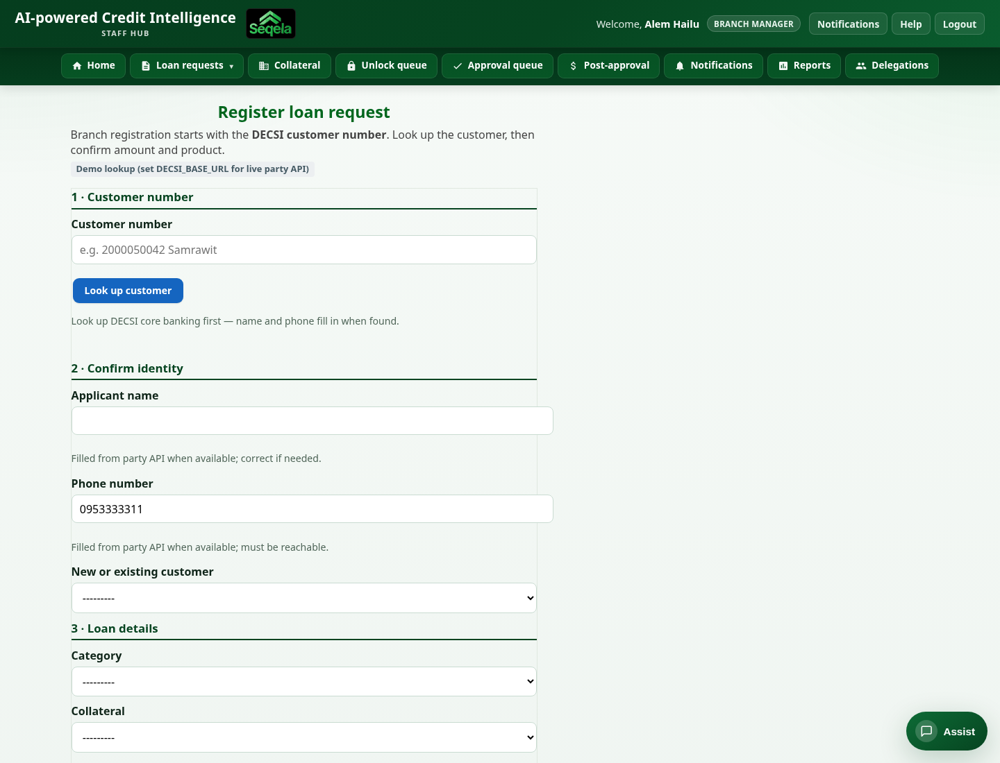

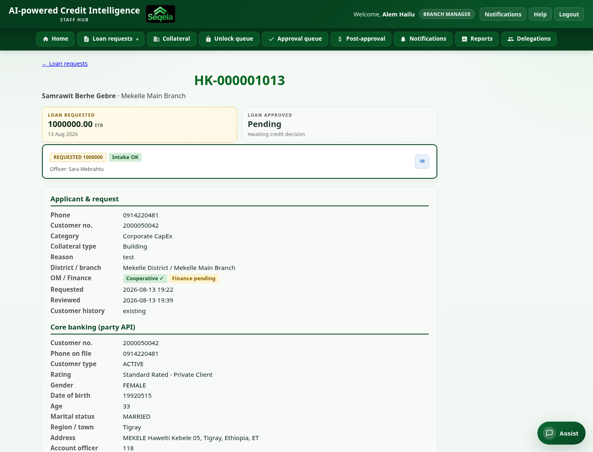

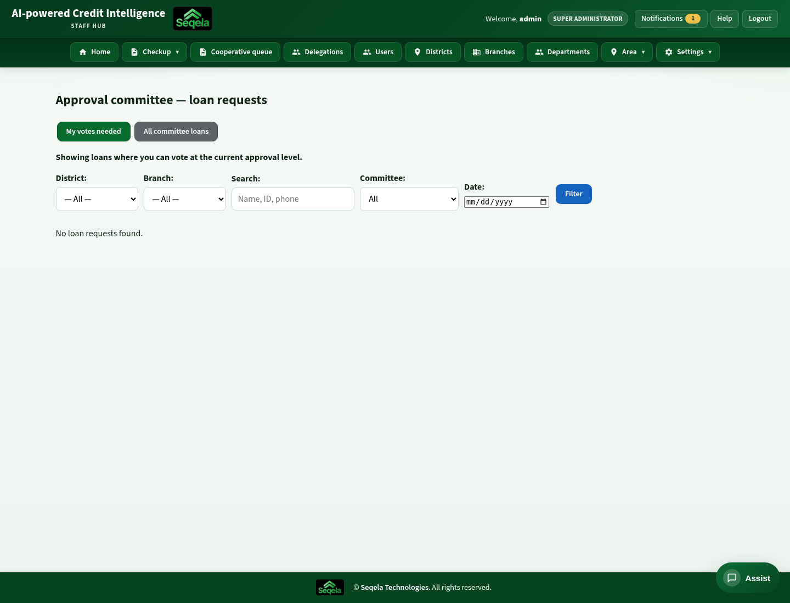

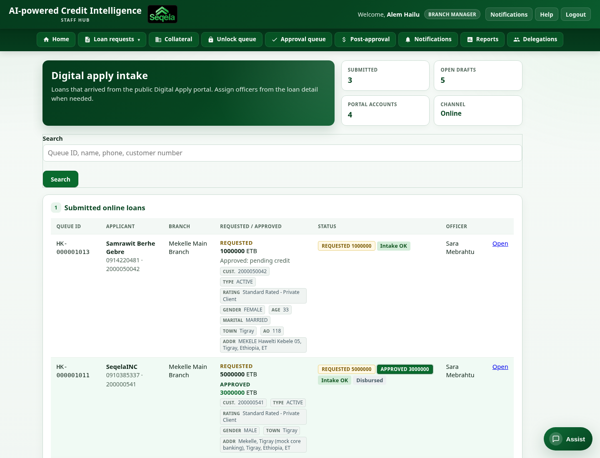

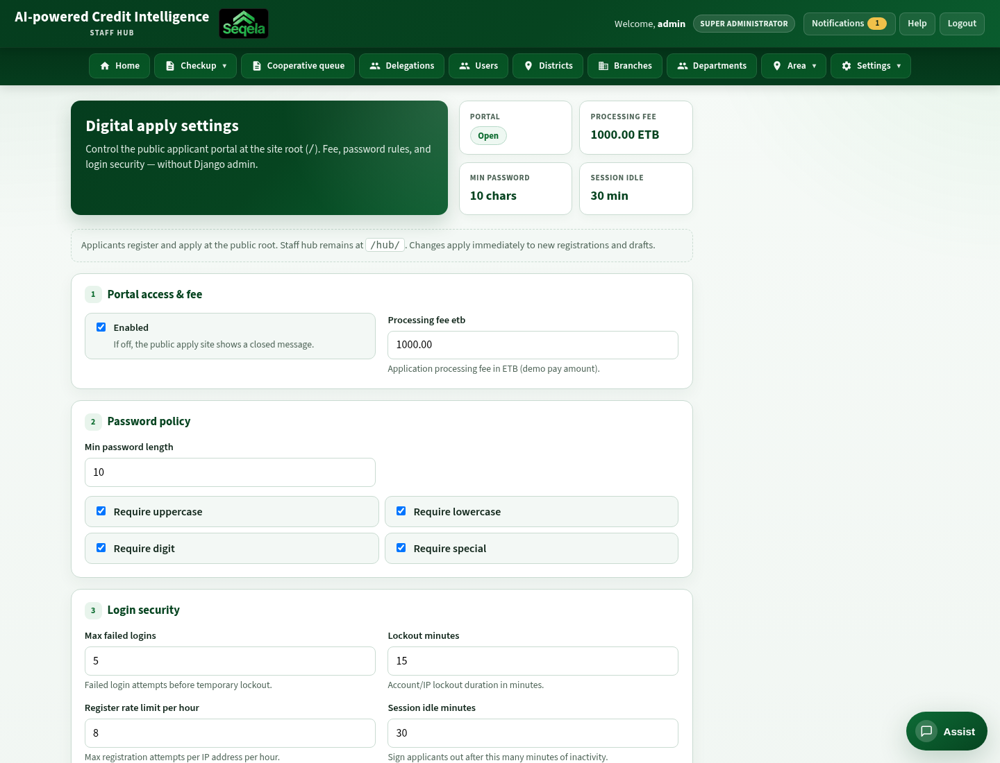

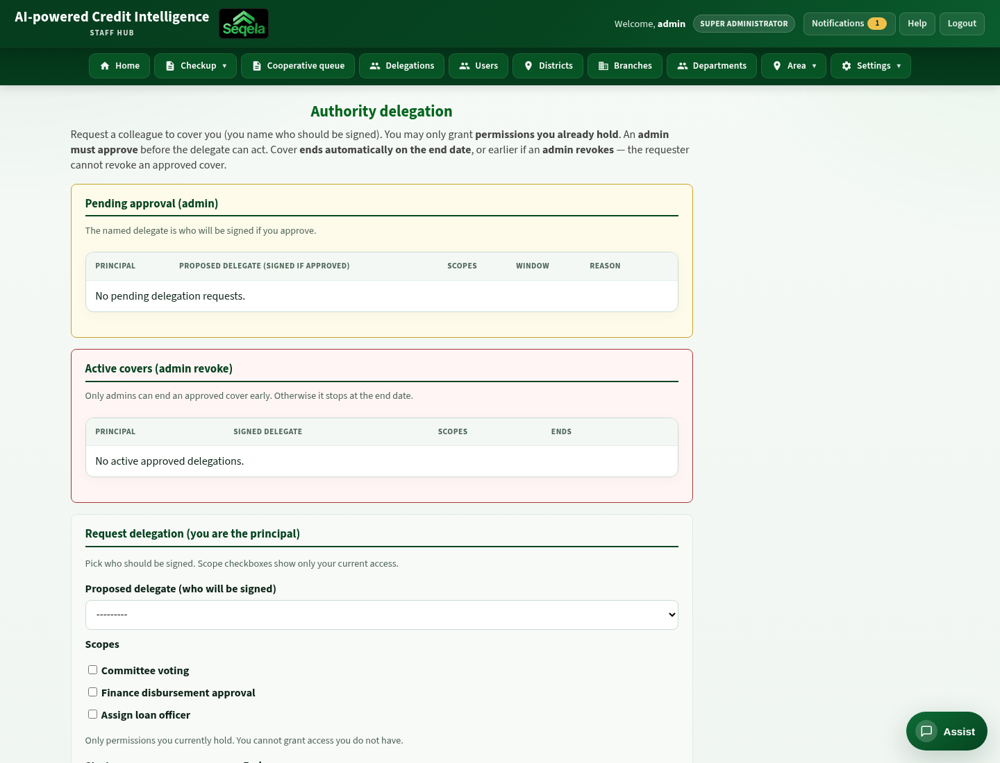

## Seqela Market

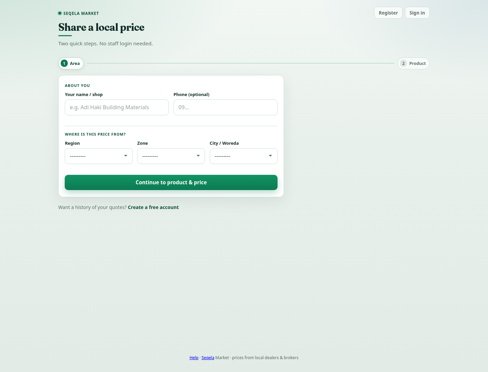

## How to refresh captures

With the app running on port 8000 and Google Chrome installed:

```bash
# Full pack (admin + applicant):
node docs/user_manual/capture_manual_shots.js

# Staff create/detail + wizard fixups (branch manager + applicant):
node docs/user_manual/capture_manual_shots_fixup.js

docker compose exec web python docs/user_manual/build_pdf.py
```

| ID | URL / note | File |
|----|------------|------|
| C-01 | `/` | `C-01_landing.png` |
| C-02 | `/register/` | `C-02_register.png` |
| C-03 | `/login/` | `C-03_login.png` |
| C-04 | `/home/` (signed in) | `C-04_home_applications.png` |
| C-05…C-08 | Apply wizard steps | `C-05_apply_details.png` … `C-08_apply_submit.png` |
| C-09 | Status after submit | `C-09_apply_status.png` |
| C-11 | `/help/` | `C-11_help.png` |
| C-13 | `/apply/<id>/schedule/` | `C-13_apply_schedule.png` |
| H-01 | `/hub/login/` | `H-01_hub_login.png` |
| H-04 | `/hub/` | `H-04_hub_home.png` |
| H-07 | `/hub/view_loan_requests/` | `H-07_loan_requests.png` |
| H-08 | `/hub/create_loan_request/` (BM / credit) | `H-08_create_loan.png` |
| H-09 | `/hub/loan_request_detail/<id>/` | `H-09_loan_detail.png` |
| H-18 | `/hub/online_loan_intake/` | `H-18_online_intake.png` |
| H-23 | `/hub/delegations/` | `H-23_delegations.png` |
| M-01 | `/market-portal/` | `M-01_market.png` |
